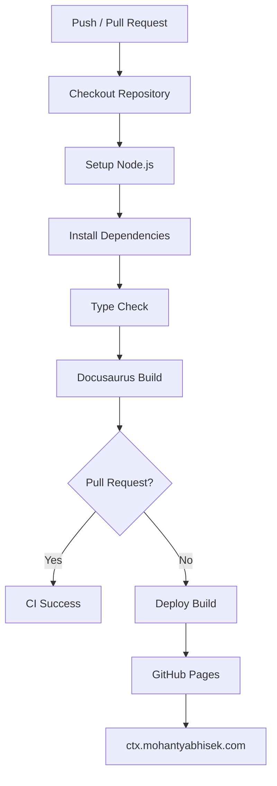
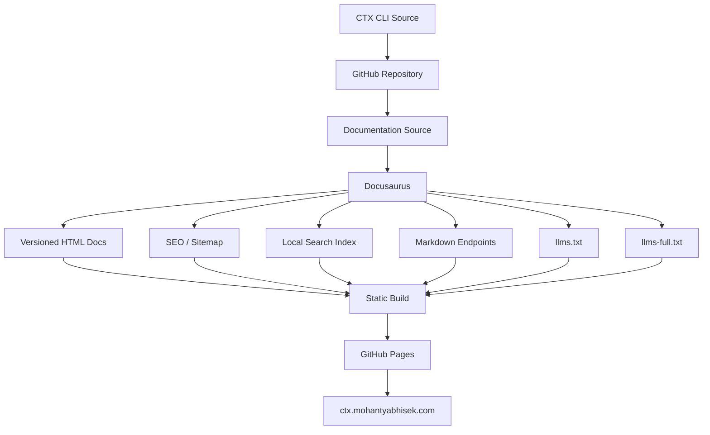

# CTX CLI Documentation

Documentation website for [CTX CLI](https://github.com/abhisekmohantychinua/ctx-cli), built with Docusaurus and published as a static site through GitHub Pages.

CTX CLI is a CLI-based execution context system for professional developers. It captures why decisions are made, why work is being done, and what state a project is in, with a focus on structured, AI-readable execution context.

This repository contains the documentation system for CTX CLI. The documentation is designed to serve both developers and AI agents, while keeping the source, build, and deployment model straightforward.

## Stack

The documentation site uses:

- Docusaurus 3.10.x with TypeScript
- Docusaurus documentation versioning
- Docusaurus SEO and sitemap support
- `@writechoice/docusaurus-plugin-llms-txt` for AI-readable documentation
- `@easyops-cn/docusaurus-search-local` for local documentation search
- GitHub Actions for CI and deployment
- GitHub Pages for static hosting
- `ctx.mohantyabhisek.com` as the production domain

Docusaurus 3.10.2 is the current stable 3.x documentation version. citeturn0search4

The site intentionally remains static. There is no documentation backend, search server, or runtime application required to serve the generated site.

---

## Development

Install dependencies:

```bash
npm install
```

Start the development server:

```bash
npm run start
```

Docusaurus will serve the documentation locally and rebuild pages as Markdown or configuration files change.

For production behavior, use the production build instead:

```bash
npm run build
```

The generated site can then be served locally with:

```bash
npm run serve
```

The production build is important because versioned documentation, search indexes, `llms.txt`, `llms-full.txt`, Markdown endpoints, and other generated assets should be evaluated from the same output that will eventually be deployed.

---

## Documentation Structure

Documentation source lives under `docs/`.

The structure should follow the way developers use CTX rather than mirroring the internal source tree of the CLI.

A typical structure can look like:

```text
docs/
├── intro.md
├── installation.md
├── getting-started/
│   ├── quick-start.md
│   └── first-project.md
├── concepts/
├── commands/
│   ├── init.md
│   ├── status.md
│   ├── collect.md
│   └── update.md
├── configuration/
└── examples/
```

A page should explain one clear subject. Command documentation should explain the command's purpose, syntax, arguments, options, output, side effects, and examples.

For example:

```markdown
---
id: status
title: status
description: Inspect the current CTX project context and configuration.
---

# `ctx status`

Shows the current CTX project status.

## Usage

```bash
ctx status
```

## Behavior

This command is read-only and does not modify project files.

```

Keep the source documentation as the canonical content. Generated HTML, Markdown, and AI-oriented files should come from this source rather than being maintained separately.

---

# Documentation Versioning

CTX CLI follows semantic versioning for releases, and the documentation should preserve the documentation that belongs to each released CLI version.

The release model used by CTX CLI is:

```text
MAJOR.MINOR.PATCH
```

For example:

```text
1.0.0
1.1.0
1.1.1
2.0.0
```

Major versions represent breaking changes, minor versions add backward-compatible features, and patch versions contain bug fixes and minor improvements. fileciteturn2file0L9-L23

Docusaurus documentation versioning is used to preserve the corresponding documentation snapshot.

## Current Documentation

The `docs/` directory represents the current documentation.

```text
docs/
```

This is where new documentation is written while the next CTX CLI release is being developed.

When a release needs a stable documentation snapshot, create a Docusaurus version from the current documentation:

```bash
npm run docusaurus docs:version 1.0
```

Docusaurus creates the versioned documentation and sidebar data for that snapshot.

The resulting repository structure is conceptually:

```text
docs/
    current documentation

versioned_docs/
    version-1.0/

versioned_sidebars/
    version-1.0-sidebars.json

versions.json
```

The exact generated files are managed by Docusaurus.

## How Releases and Documentation Versions Relate

The Git tag remains the source of truth for the CTX CLI release. CTX CLI uses tags such as:

```text
v1.0.0
v1.1.0
v2.0.0
```

and each tagged release produces its release artifacts through GitHub Releases.

The documentation version should describe the same released behavior.

The relationship is therefore:

```text
CTX CLI v1.0.0
       │
       └── Docusaurus docs 1.0

CTX CLI v1.1.0
       │
       └── Docusaurus docs 1.1
```

A released documentation version should not be rewritten later to describe a newer CLI.

Instead, continue development in `docs/` and create another version when the next release is ready.

```text
Released version
       │
       ├── remains stable
       │
       ▼
Current docs/
       │
       ├── new commands
       ├── changed behavior
       └── new examples
       │
       ▼
Next documentation version
```

This is particularly important for a CLI because command names, flags, configuration formats, and behavior can change between releases.

## Versioned Documentation URLs

Docusaurus handles the version routes and version selector.

The exact generated URL depends on the configured version naming and routing, but the intended model is:

```text
/docs/...
/docs/1.0/...
/docs/1.1/...
```

The current version remains the primary documentation experience, while older versions remain available for users working with older CTX releases.

## Versioning and AI-readable Documentation

Versioning must also apply to AI-readable documentation.

An agent reading documentation for CTX CLI 1.0 should not accidentally receive the command behavior documented for CTX CLI 1.1.

The AI documentation layer therefore follows the same source hierarchy:

```text
Docusaurus documentation
          │
          ├── current version
          ├── versioned documentation
          │
          ▼
    generated Markdown
          │
          ├── page Markdown
          ├── llms.txt
          └── llms-full.txt
```

Whenever Docusaurus versioning is changed, the production output should be inspected to ensure the generated Markdown and AI resources correspond to the intended documentation version.

---

# SEO

SEO is handled primarily through Docusaurus configuration and the structure of the documentation itself.

The site should provide meaningful page titles, descriptions, canonical URLs, semantic headings, internal links, and a sitemap.

The production URL is configured in `docusaurus.config.ts`:

```ts
url: 'https://ctx.mohantyabhisek.com',
baseUrl: '/',
```

The custom domain is important because Docusaurus uses `url` and `baseUrl` when generating canonical URLs and other absolute links.

## Page Metadata

Documentation pages should provide useful metadata when the default generated title or description is not enough.

For example:

```markdown
---
id: installation
title: Installation
description: Install CTX CLI and verify that it is available in your terminal.
---
```

The description should explain the page rather than simply repeat its title.

## Sitemap

Docusaurus's classic preset provides sitemap generation.

The production build generates:

```text
sitemap.xml
```

The sitemap should be treated as part of the static documentation output rather than as a separately maintained file.

Docusaurus's SEO documentation covers sitemap generation and other SEO configuration.

The resulting production structure is conceptually:

```text
build/
├── index.html
├── sitemap.xml
├── docs/
└── ...
```

## Versioned Documentation and SEO

Versioned documentation introduces multiple URLs containing related content.

The site should therefore make a deliberate distinction between:

```text
current documentation
```

and:

```text
historical documentation
```

The current version is the primary documentation experience.

Historical versions exist because developers may still be using older CTX CLI releases. They should remain accessible without allowing the documentation to become ambiguous about which CLI version a page describes.

The documentation version selector should always make the selected version obvious.

---

# AI-readable Documentation

CTX CLI documentation is designed to be consumed by AI agents as well as humans.

The AI-facing layer consists of:

```text
/llms.txt
/llms-full.txt
/<documentation-path>.md
```

These files are generated from the Docusaurus documentation using:

```text
@writechoice/docusaurus-plugin-llms-txt
```

The plugin generates `llms.txt`, `llms-full.txt`, and Markdown versions of documentation pages at build time. citeturn0search1

## Installation

Install the plugin:

```bash
npm install @writechoice/docusaurus-plugin-llms-txt
```

Add it to `docusaurus.config.ts`:

```ts
plugins: [
  [
    '@writechoice/docusaurus-plugin-llms-txt',
    {
      generateLlmsTxt: true,
      generateLlmsFullTxt: true,
      generateMarkdownFiles: true,
      description:
        'Documentation for CTX CLI, a CLI-based execution context system for professional developers.',
    },
  ],
],
```

The plugin enables all three outputs by default, but keeping the configuration explicit makes the documentation build easier to understand. citeturn0search1

## `llms.txt`

`llms.txt` is the entry point for AI-readable documentation.

Its role is to answer:

```text
What is CTX?
Where is the documentation?
Which pages should I read?
Where is the complete documentation?
Where are the Markdown versions?
```

The generated file is organized from the documentation structure and links to Markdown documentation pages. citeturn0search1

The intended flow is:

```text
AI agent
   │
   ▼
/llms.txt
   │
   ├── Introduction
   ├── Getting Started
   ├── Commands
   ├── Configuration
   └── Examples
          │
          ▼
     relevant .md page
```

`llms.txt` should be treated as a convention for documentation discovery. It does not replace `robots.txt`, normal search indexing, or the documentation itself, and it does not guarantee that every AI system will read it.

## `llms-full.txt`

`llms-full.txt` provides the documentation as one combined resource.

The plugin merges documentation content into a single file in sidebar order. citeturn0search1

Conceptually:

```text
/llms-full.txt

Introduction
---
Installation
---
Getting Started
---
Commands
---
Configuration
---
Examples
```

This is useful when an AI client wants broad context without fetching every Markdown page individually.

Because it is generated from the same documentation source, it stays aligned with the documentation build.

## Markdown Endpoints

Each documentation page is exposed as raw Markdown.

For example:

```text
/docs/installation
```

has a corresponding:

```text
/docs/installation.md
```

The generated Markdown contains the documentation content without the normal website presentation layer. citeturn0search1

This creates a clean relationship:

```text
Human
  │
  ▼
/docs/installation

AI / plain-text client
  │
  ▼
/docs/installation.md
```

The Markdown endpoint should be considered a generated representation of the canonical documentation, not another source that developers edit.

## Build Output

After:

```bash
npm run build
```

the generated output contains the AI-facing resources.

The important part of the architecture is:

```text
docs/*.md / *.mdx
        │
        ▼
    Docusaurus
        │
        ├── HTML
        ├── *.md
        ├── llms.txt
        └── llms-full.txt
```

There should be no manually maintained duplicate documentation for these resources.

---

# Copy Markdown

Copying documentation as Markdown is useful for developers who want to move a page into an AI tool, issue, editor, or terminal.

It is not required for the AI compatibility layer itself.

The important resources are:

```text
llms.txt
llms-full.txt
*.md
```

A Copy Markdown control is therefore treated as a presentation feature rather than a documentation architecture requirement.

If the UI is added, the `@writechoice/docusaurus-theme-llms-txt` companion package is worth considering because it is designed to work with the same `@writechoice/docusaurus-plugin-llms-txt` package and provides user-facing AI/Markdown actions. citeturn0search1

The underlying principle remains:

```text
Canonical docs
      │
      ├── HTML page
      ├── Markdown page
      └── AI resources

Copy button
      │
      └── convenient access to the Markdown representation
```

The button should never become another source of documentation content.

---

# Local Search

The documentation uses local search through:

```text
@easyops-cn/docusaurus-search-local
```

The package is a local/offline search plugin and theme for Docusaurus v2/v3. It builds a search index from the documentation so that the deployed site does not need a search backend. citeturn0search0

This fits the GitHub Pages model particularly well.

The search architecture is:

```text
Documentation source
        │
        ▼
Docusaurus build
        │
        ▼
Search index
        │
        ▼
Static files
        │
        ▼
GitHub Pages
```

The browser performs the search against the generated local index.

## Installation

Install the package:

```bash
npm install @easyops-cn/docusaurus-search-local
```

Configure it under `themes` in `docusaurus.config.ts`:

```ts
themes: [
  [
    require.resolve('@easyops-cn/docusaurus-search-local'),
    {
      hashed: true,
      indexDocs: true,
      indexBlog: false,
      indexPages: false,
      language: ['en'],
    },
  ],
],
```

The package documents `hashed: true` as useful for long-term caching of the generated search index. It also supports separate controls for indexing docs, blog posts, and pages. citeturn0search0

For a documentation-only CTX site, indexing the docs while leaving the blog and standalone pages disabled keeps the search scope focused.

## Search Behavior

The search index should contain the documentation that a developer expects to find.

For CTX, that means commands, configuration, concepts, examples, and installation documentation should be searchable.

Search should not become a replacement for navigation.

Navigation answers:

```text
Where does this topic belong?
```

Search answers:

```text
Where is the information I'm looking for?
```

Both are useful for CLI documentation.

## Versioned Search

Versioned documentation needs additional care because the same command can exist in several versions with different behavior.

The local search package supports Docusaurus v3 and provides options for documentation routes and preferred versions. citeturn0search0

The search experience should therefore preserve the user's selected documentation version.

For example:

```text
CTX CLI 1.0 documentation
        │
        ▼
      Search
        │
        ▼
CTX CLI 1.0 result
```

rather than:

```text
CTX CLI 1.0 documentation
        │
        ▼
      Search
        │
        ▼
CTX CLI 2.0 result
```

This matters especially for command reference pages.

---

# Static Site Generation

The site is built as a static application.

Docusaurus turns the Markdown/MDX source and site configuration into files that can be served directly by a static host.

The build process is:

```text
Markdown / MDX
      │
      ▼
Docusaurus
      │
      ├── Versioned documentation
      ├── SEO metadata
      ├── Search index
      ├── Markdown pages
      ├── llms.txt
      └── llms-full.txt
              │
              ▼
           build/
              │
              ▼
        GitHub Pages
```

This is the main reason GitHub Pages works well for the project.

There is no runtime Node.js server required after the build has completed.

The development environment uses Node.js to build the site; the deployed site is simply the generated static output.

---

# GitHub Pages Deployment

GitHub Pages serves the generated Docusaurus output.

Docusaurus supports GitHub Pages deployment and provides a GitHub Actions-based deployment model for publishing the generated site. For a custom domain, Docusaurus recommends placing a `CNAME` file in the `static` directory so that it is copied into the generated build. citeturn0search7

The deployment model is:

```text
feature/*
    │
    ▼
Pull Request
    │
    ▼
main
    │
    ▼
GitHub Actions
    │
    ▼
npm ci
    │
    ▼
npm run build
    │
    ▼
build/
    │
    ▼
GitHub Pages
    │
    ▼
ctx.mohantyabhisek.com
```

The repository remains the source of truth. GitHub Actions performs the build, and GitHub Pages serves the resulting static artifact.

## Docusaurus Configuration

The production URL should be configured as:

```ts
url: 'https://ctx.mohantyabhisek.com',
baseUrl: '/',
```

The `baseUrl` is `/` because the site is intended to live at the root of the custom subdomain rather than under a repository path.

## Custom Domain

Create:

```text
static/CNAME
```

with:

```text
ctx.mohantyabhisek.com
```

The file should contain the domain and nothing else.

Docusaurus copies files from `static/` into the generated site, so the production build will contain:

```text
build/CNAME
```

GitHub Pages then uses that file as the custom-domain configuration. citeturn0search7

## DNS

The DNS provider must also be configured so that:

```text
ctx.mohantyabhisek.com
```

resolves to the GitHub Pages deployment according to GitHub's custom-domain configuration.

The repository does not contain DNS credentials or provider configuration.

The important separation is:

```text
Docusaurus
    │
    └── knows the canonical website URL

GitHub Pages
    │
    └── serves the generated files

DNS
    │
    └── connects ctx.mohantyabhisek.com to GitHub Pages
```

---

# Continuous Integration and Deployment

The documentation repository uses GitHub Actions for both CI and deployment.

CI runs on:

- Pull Requests
- pushes to `main`

The purpose is to make the production build part of the normal development workflow.

The pipeline is:



The important part is that CI validates the same build process that deployment uses.

A documentation change should therefore not be considered valid merely because the development server renders it correctly.

The production build must also succeed.

The basic build commands are:

```bash
npm ci
npm run build
```

If a type-checking script is configured:

```bash
npm run typecheck
```

The workflow can then deploy the generated `build/` directory to GitHub Pages.

A pull request should pass CI before it is merged into `main`.

---

# Branching Strategy

CTX CLI documentation follows a simple trunk-based workflow.

## Branches

- `main` – Stable and deployable documentation
- `feature/*` – Feature development branches

## Examples

```text
feature/versioning
feature/search
feature/llms-txt
feature/github-pages
feature/seo
feature/command-reference
```

## Workflow

```text
feature/*
    ↓
Pull Request
    ↓
Review
    ↓
Merge to main
    ↓
GitHub Pages Deployment
```

The `main` branch represents the documentation that can be published.

Feature branches are used for changes that need to be developed and reviewed independently.

## Example

Create a feature branch:

```bash
git checkout -b feature/versioning
```

Commit and push changes:

```bash
git add .
git commit -m "Configure documentation versioning"
git push origin feature/versioning
```

Open a Pull Request:

```text
feature/versioning → main
```

Review the changes, address feedback if needed, and merge the Pull Request.

After the Pull Request reaches `main`, GitHub Actions builds the documentation and publishes the resulting static site to GitHub Pages.

This keeps the deployment path simple:

```text
feature/*
    ↓
Pull Request
    ↓
main
    ↓
GitHub Actions
    ↓
GitHub Pages
```

---

# Release and Documentation Workflow

CTX CLI uses Git tags as the source of truth for releases. fileciteturn2file0L29-L35

The documentation follows the same release boundary.

A typical release looks like:

```text
Development
    │
    ▼
feature/*
    │
    ▼
Pull Request
    │
    ▼
main
    │
    ▼
Documentation version
    │
    ▼
CTX CLI release tag
    │
    ▼
GitHub Release
```

For example:

```bash
git checkout main
git pull origin main

git tag v1.0.0
git push origin v1.0.0
```

The CTX CLI release workflow then builds and publishes the release artifacts from that tagged commit. fileciteturn2file0L95-L105

The documentation site itself is continuously deployed from `main`. A release tag establishes the CTX CLI version; Docusaurus versioning preserves the documentation snapshot associated with that release.

---

# Documentation and Release Metadata

CTX CLI's GitHub Releases are the source of truth for release metadata, changelogs, and downloadable release assets. fileciteturn2file0L406-L406

The documentation website can therefore consume release information directly from GitHub rather than maintaining a second release database.

The release architecture is:

```text
CTX CLI
   │
   ▼
Git tag
   │
   ▼
GitHub Release
   │
   ├── Version
   ├── Release notes
   └── Release assets
          │
          ▼
Documentation website
```

This keeps release information in one place.

If a release page is displayed on the documentation website, it should derive its version, publication date, notes, and download links from GitHub Releases rather than duplicating those values in documentation source.

---

# How the Pieces Fit Together

The complete documentation architecture is intentionally layered.



The key principle is that there is one documentation source.

```text
Markdown / MDX
      │
      ▼
Docusaurus
      │
      ├── Human documentation
      ├── Versioned documentation
      ├── Search
      ├── SEO
      ├── Markdown
      ├── llms.txt
      └── llms-full.txt
```

Nothing downstream should become an independent source of truth.

---

# Why This Architecture

The documentation site has two audiences.

The first is the developer reading a normal documentation website.

The second is an AI agent trying to understand and operate CTX CLI.

The same documentation source serves both.

```text
                     Documentation Source
                            │
                 ┌──────────┴──────────┐
                 │                     │
              Humans                AI agents
                 │                     │
                 ▼                     ▼
              HTML                  Markdown
            Search                 llms.txt
           Navigation           llms-full.txt
```

Versioning keeps the information accurate for older CTX CLI releases.

Local search keeps the site self-contained.

Static generation keeps deployment simple.

GitHub Pages removes the need for application hosting.

The AI-readable endpoints make the documentation available in forms that are easier for agents and plain-text tooling to consume.

The result is a documentation system where the same source can be:

```text
read by a developer
        ↓
searched in the browser
        ↓
opened as Markdown
        ↓
discovered through llms.txt
        ↓
loaded through llms-full.txt
        ↓
served entirely from a static deployment
```

That is the intended shape of the CTX CLI documentation site.
