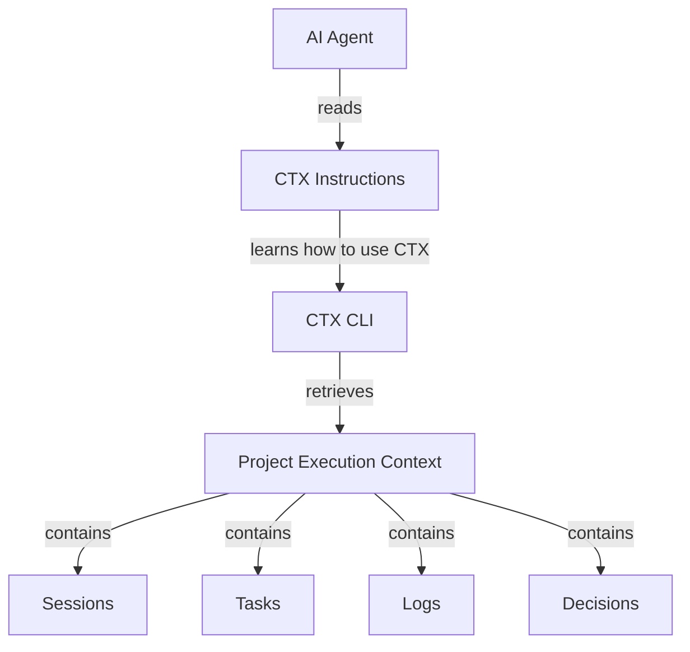

# Instruction

CTX can generate an instruction file that teaches an AI agent how to use CTX while working on a project.

The generated instructions do not contain the project's execution context. Instead, they explain how the agent can retrieve that context from CTX when it needs it.

This keeps the instructions stable while the project context continues to change through sessions, tasks, logs, and decisions.

## What Is `instructions.md`?

An instruction file is a Markdown file containing persistent guidance for an AI development environment.

AI coding tools commonly use project instruction files to provide information that should remain available while the agent works on a project. For example, GitHub Copilot supports repository-wide instruction files such as `.github/copilot-instructions.md` and agent instruction files such as `AGENTS.md`. Cursor provides project rules through `.cursor/rules` and also supports `AGENTS.md`.

These files are useful because the guidance is available without requiring the user to repeat the same instructions in every prompt.

In CTX, the generated instruction serves a more specific purpose. It tells the AI agent  that CTX is available in this project. Use it to retrieve the project's execution context when that context is relevant to your work.

The instruction file therefore acts as the connection between an AI agent and the dynamic context maintained by CTX.

## The Role of the Generated Instruction

The generated instruction provides a simple workflow for an AI agent:



This means CTX does not need to copy its entire context into the instruction file. The instruction remains stable while the execution context remains dynamic. When the agent needs more information, it can use CTX to obtain the current state.

## Generated Instructions Are Not Project Context

CTX does not generate a file containing the current task, recent logs, previous sessions, project decisions or the current project state.

Those records remain inside the project's CTX context. Instead, the generated instruction explains how an AI agent can access them.

As the project changes, the execution context changes. The generated instructions do not need to be regenerated simply because a task, session, log, or decision changed.

:::note
**Instructions teach the AI how to access CTX.**  
**CTX provides the project's changing execution context.**
:::

## Working with AI Environments

Different AI environments use different instruction-file conventions.

CTX provides presets that place its generated instruction in a location recognized by the selected environment.

| Preset | Instruction File |
| --- | --- |
| `firebase` | `airules.md` |
| `copilot` | `.github/copilot-instructions.md` |
| `cursor` | `.cursor/rules/instructions.md` |
| `jetbrains` | `.junie/guidelines.md` |
| `vscode` | `.instructions.md` |
| `windsurf` | `.windsurf/rules/instructions.md` |
| `codex` | `AGENTS.md` |
| `claude` | `CLAUDE.md` |

These presets only determine **where the generated instructions are written**. The generated content remains focused on making CTX available to the AI workflow.

AI environments increasingly support persistent project-level instruction mechanisms, but the location and format vary between environments. CTX uses presets so users do not need to manually determine the appropriate destination for each supported environment.

## Generating Instructions

Use the `instruction` command to generate the CTX instructions.

```bash
ctx generate instruction
```

The command requires exactly one destination source:

- an environment preset
- a custom path

### Using a Preset

A preset selects the destination associated with a supported AI environment.

For example:

```bash
ctx generate instruction --preset codex
```

writes the instructions to the location associated with the `codex` preset.

Another example:

```bash
ctx generate instruction --preset claude
```

writes the instructions to the location associated with the `claude` preset.

The generated content is obtained from CTX's versioned instruction specification so that the instructions can remain aligned with the current CTX command and context model.

The command does not require the user to manually maintain a copy of the CTX instruction specification.

### Using a Custom Path

A custom path can be used when the target environment or workflow does not use one of the predefined presets.

For example:

```bash
ctx generate instruction --path instructions.md
```

or:

```bash
ctx generate instruction --path docs/ai/ctx.md
```

The path must be:

- relative to the project
- a Markdown file
- within the project directory

This allows the user to decide exactly where the CTX instructions should live.

### Presets and Custom Paths

Presets and custom paths solve the same problem in different ways. A preset is convenient when the target environment is already supported. Where as a custom path provides direct control. Only one is required for each generation.

The command therefore rejects:

```bash
ctx generate instruction
```

```bash
ctx generate instruction --preset codex --path instructions.md
```

### Updating an Existing Instruction File

CTX preserves existing instruction content unless explicitly instructed to overwrite it.

When the target file already contains content and `--overwrite` is not provided, CTX appends the newly generated CTX instructions to the existing file.

This allows project-specific instructions to remain intact while adding or refreshing CTX integration guidance.

For example:

```markdown
# Project Guidelines

Use the existing service-layer architecture.

---

# CTX

Use CTX to retrieve project execution context when required.
```

The user remains in control of the resulting Markdown file and can edit it after generation.

### Overwriting an Existing Instruction File

Use `--overwrite` when the existing file should be replaced by the newly generated CTX instructions.

```bash
ctx generate instruction --preset codex --overwrite
```

Without `--overwrite`, existing content is preserved. With `--overwrite`, the existing content is replaced.

This makes replacement an explicit action rather than a side effect of instruction generation.

### Keeping Instructions Up to Date

CTX retrieves the generated instruction content from its versioned instruction specification rather than embedding a fixed copy into the executable. This allows the instruction content to evolve with CTX.

When CTX's command surface, context model, or recommended AI workflow changes, a newly generated instruction can reflect the corresponding specification.

The user does not need to manually track the location or version of the instruction specification.

### Instructions Are Versioned

Generated instructions are based on a versioned CTX instruction specification.

This provides two benefits:

- The generated content can evolve with CTX.
- Projects can regenerate instructions using the instruction model appropriate to the installed CTX version.

The versioned specification is an implementation detail of how CTX keeps generated instructions current. Users only need to select the desired preset or path.

## Instruction Command Options

| Option | Required | Type | Description |
| --- | --- | --- | --- |
| `--preset` | No* | string | Select a supported AI environment preset. |
| `--path` | No* | path | Specify a relative Markdown file path. |
| `--overwrite` | No | boolean | Replace the existing instruction file. |

\* Exactly one of `--preset` or `--path` must be provided.

## Common Use Cases

### Make an AI Agent Aware of CTX

A project already uses CTX and you want a supported AI environment to understand how to access it.

```bash
ctx generate instruction --preset codex
```

### Use CTX with a Different AI Environment

The environment is not represented by a preset, or you prefer to control the location yourself.

```bash
ctx generate instruction --path docs/ai/ctx.md
```

### Refresh Existing CTX Instructions

Generate the current instruction specification while preserving the existing file content.

```bash
ctx generate instruction --preset codex
```

### Replace Existing Generated Content

Replace the existing file with the newly generated instructions.

```bash
ctx generate instruction --preset codex --overwrite
```

## Summary

The CTX instruction feature makes CTX understandable and usable to AI agents without embedding dynamic project context inside the instruction file.

The generated instruction:

- tells an AI agent that CTX is available
- explains how CTX can be used
- teaches the agent how to retrieve execution context
- remains separate from dynamic project data
- can be placed using an environment preset or custom path
- is generated from a versioned CTX instruction specification
- can coexist with project-specific AI guidelines
- remains an ordinary Markdown file that the user can inspect and edit
