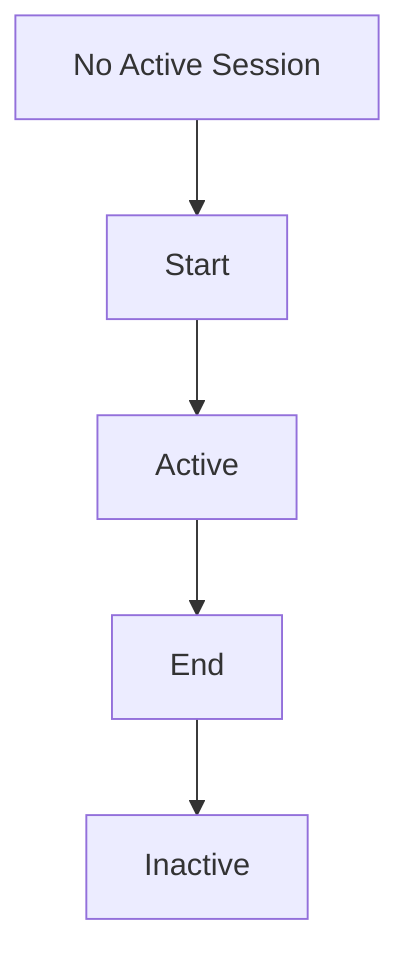

# Sessions

A **Session** represents a continuous period of active work on a project.

Sessions give CTX a temporal boundary around project activity, allowing tasks, logs, and decisions to be understood in the context of a specific period of execution.

A session is not a terminal session, IDE session, login session, or authentication session. It is simply a record of when work on a project started and when that period of work ended.

## Why Sessions Exist

Development work is rarely continuous.

You may work on a project for two hours, leave it for a day, and return later to continue the same task. Without sessions, CTX can record what happened but cannot reliably distinguish between different periods of active work.

Sessions provide that temporal context. This allows CTX to distinguish between work performed during different periods while preserving the overall project context.

For example:

```text
Monday
09:30 ─────────── 11:15
      Session 1

Tuesday
14:00 ───────────────── 17:20
      Session 2
```

Both sessions belong to the same project, but they represent different periods of execution.

## Session Lifecycle

A session follows a simple lifecycle:



### Starting a Session

When a session starts, CTX:

- Creates a new session record.
- Records the session start time.
- Marks the session as `ACTIVE`.
- Makes the session the project's active session.

### Ending a Session

When a session ends, CTX:

- Records the session end time.
- Marks the session as `INACTIVE`.
- Removes it as the project's active session.
- Preserves the session as part of the project's history.

An ended session is not deleted.

{/*
<!-- TODO: MOVE DATA MODEL TO REFERENCES. -->
*/}

## Session Data Model

A session contains the information required to identify and describe a period of project activity.

| Field | Description |
| --- | --- |
| id | Unique identifier for the session. |
| notes | Optional description of the purpose or context of the session. |
| createdAt | Timestamp at which the session started. |
| endedAt | Timestamp at which the session ended. Stays `null` while active. |
| status | Current state of the session: `ACTIVE` or `INACTIVE`. |

### Active Session

A project can have at most one active session at a time.

When a session is active, it represents the work currently taking place on the project.

An active session remains active until it is explicitly ended. If you attempt to start another session while a session is already active, CTX does not silently replace the existing session. You must either end the current session before starting a new one. Or explicitly request that the current session be ended as part of starting the new session.

This ensures that the project's current execution state remains explicit and predictable.

### Session Notes

Session notes provide a short description of the purpose or context of a session.

They are intended to provide enough context to understand what a session was about without requiring the reader to inspect every log associated with it.

For example:

```text
Implementing OAuth authentication flow
```

or:

```text
Investigating intermittent API timeout
```

Session notes are limited to **300 characters**.

## Sessions and Tasks

Sessions and tasks represent different dimensions of project execution. A **session** represents a period of work. A **task** represents the work being performed. A session can continue across multiple tasks. Similarly a task can be completed in multiple sessions.

The session does not own the task neither the task owns the session. Instead, they provide temporal context about what is being worked on. In simple terms, session answers "When did I work?". While task answers "What am I working on?".

## Sessions and Logs

Logs capture events, observations, and activity that occur during project execution.

When a session is active, there's an option to associate log with a session.

The session therefore acts as a temporal boundary around the events that occurred during a period of work.

This makes a session more than a timer. It provides context for interpreting the events recorded within that period.

:::note

**Session notes describe the session. Logs describe events that occur during the session.**

:::

## Sessions and Decisions

Important project decisions can also be associated with work taking place during a session.

This allows CTX to preserve not only what happened, but also the decisions made while the work was being performed.

Combined with tasks and logs, session context can provide a more complete representation of project execution.

## Session History

Ending a session does not remove it from the project. Instead, the session becomes part of the project's historical record. Then historical sessions can be used to:

- Review previous periods of work.
- Understand how project activity progressed over time.
- Query past execution context.
- Export project history.
- Analyze work patterns.
- Provide input to CTX's snapshot system.

A project may therefore contain many sessions:

```text
Session 1    Monday      1h 45m
Session 2    Tuesday     3h 20m
Session 3    Thursday      52m
Session 4    Friday      2h 10m
```

Each session represents an independent period of active work while remaining part of the same project's execution history. The accumulated session history provides a foundation for understanding project activity over time.

## Summary

Sessions provide CTX with a temporal model for project activity.

A session:

- Represents a continuous period of active work.
- Belongs to a project.
- Can be `ACTIVE` or `INACTIVE`.
- Records when work started and, when applicable, when it ended.
- May contain notes describing the the work.
- Provides context for tasks, logs, and decisions.
- Remains available after it ends as part of project history.
- Allows CTX to distinguish between separate periods of work on the same project.
