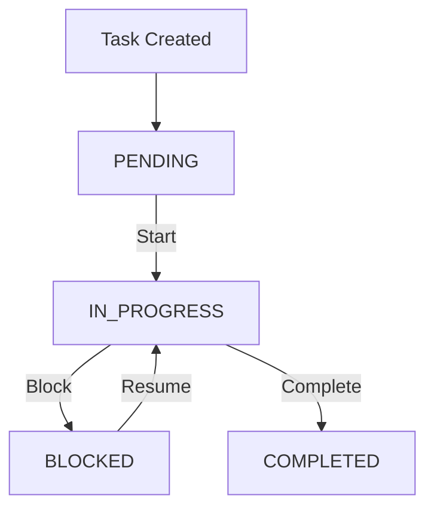
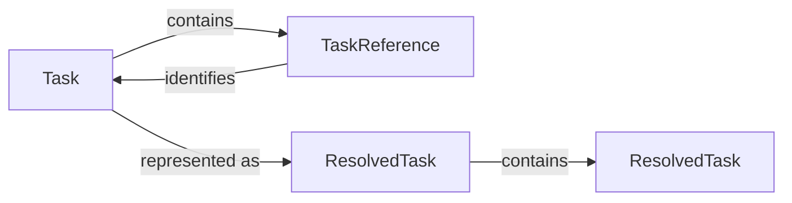

# Tasks

A **Task** represents a unit of real work within a project.

Tasks give CTX a way to describe what is being worked on and track its current execution state. They are intentionally lightweight and are designed to work alongside sessions, logs, and decisions.

## Why Tasks Exist

A project can contain many pieces of work at different stages. Tasks provide that structure.

Each task represents a unit of work that can be created, worked on, blocked, and completed. Tasks are not intended to become a full project-management system. They provide just enough structure to keep track of the work being executed.

For example:

```text
T1: Build Project Management System (PENDING)
+-- T2: Design System Architecture (PENDING)
|   +-- T5: Design Database Schema (COMPLETED)
|   +-- T6: Design API Structure (COMPLETED)
|   +-- T7: Define Authentication Strategy (PENDING)
+-- T3: Implement Core Features (PENDING)
|   +-- T8: Implement User Management (IN PROGRESS)
|   +-- T9: Implement Task Management (COMPLETED)
|   +-- T10: Implement Notifications (PENDING)
+-- T4: Testing and Deployment (PENDING)
    +-- T11: Write Unit Tests (BLOCKED)
    +-- T12: Run Integration Tests (PENDING)
    +-- T13: Configure Production Deployment (PENDING)
```

## Task Lifecycle

A task follows a simple execution lifecycle. It starts as `PENDING`, moves to `IN_PROGRESS` when work begins, and becomes `COMPLETED` when the work is finished.

A task can also become `BLOCKED` when progress cannot continue. A blocked task can return to `IN_PROGRESS` once the blocking condition is resolved.



### Creating a Task

A newly created task represents work that exists but has not started yet. When a task is created, CTX:

- Creates a new task record.
- Assigns a unique identifier.
- Records the task creation time.
- Sets its initial status to `PENDING`.

### Starting a Task

A task in this state represents work that is currently being performed. When a task is started, CTX:

- Marks the task as `IN_PROGRESS`.
- Makes the task the project's task in progress.

### Blocking a Task

When work on a task cannot continue because something is preventing progress, the task can be marked as `BLOCKED`.

CTX records the reason for the blockage in `blockReason`.

A blocked task remains part of the project's active work. Once the blocking condition is resolved, the task can be started again and return to `IN_PROGRESS`.

### Completing a Task

When the work represented by a task is finished, CTX:

- Marks the task as `COMPLETED`.
- Records the completion time in `completedAt`.

A completed task remains available as part of the project's execution history.

{/*
<!-- TODO: MOVE DATA MODEL TO REFERENCES. -->
*/}

## Task Data Model

CTX uses three related representations when working with tasks:

- `Task` - represents the complete task record.
- `TaskReference` - represents a relationship to another task by its identifier.
- `ResolvedTask` - represents a task after its references have been resolved for use.

These representations serve different purposes. A task contains its own information, while references keep task relationships lightweight. A resolved task is used when CTX needs the referenced task information rather than only its identifier.

### Task

`Task` is the primary task model persisted by CTX. It contains the information that describes the work, its current state, its lifecycle timestamps, and its relationships with subtasks.

A task contains:

| Field | Description |
| --- | --- |
| id | Unique identifier for the task. |
| task | Short description identifying the work. |
| description | Additional context about the work. |
| status | Current execution state of the task: `PENDING`, `IN_PROGRESS`, `BLOCKED`, `COMPLETED` |
| subtasks | References to tasks nested under this task. Stored as a list of `TaskReference`. |
| createdAt | Timestamp at which the task was created. |
| completedAt | Timestamp at which the task was completed. Stays `null` while not completed. |
| blockReason | Reason the task is currently blocked. Stays `null` while not blocked. |

The complete task is stored as a task record. Subtasks are not stored as complete task objects inside the parent task. Instead, the parent stores references to them.

### Task Reference

`TaskReference` is a lightweight reference to another task. It contains only the identifier of the referenced task.

A task reference contains:

| Field | Description |
| --- | --- |
| id | Unique identifier for the referenced task. |

The references do not contain copies of the referenced tasks. This is how CTX represents task hierarchy without embedding complete task records inside other tasks. For example, a parent task may contain task reference of `T2` and `T3` but the actual task records remain separate. This distinction is important because a reference answers "Which task is related to this task?". But tit does not answer "What is that task?".

### Resolved Task

A `ResolvedTask` is the representation used when a task reference has been resolved to its corresponding task. Instead of working only with `Task` and `TaskReference` CTX can resolve that reference to the corresponding task. This is particularly useful when CTX needs to display or operate on a task hierarchy.

A resolved task contains:

| Field       | Description                                                                            |
| ----------- | -------------------------------------------------------------------------------------- |
| id          | Unique identifier for the task.                                                        |
| task        | Short description identifying the work.                                                |
| description | Additional context about the work.                                                     |
| status      | Current execution state of the task: `PENDING`, `IN_PROGRESS`, `BLOCKED`, `COMPLETED`. |
| subtasks    | Resolved child tasks represented as a list of `ResolvedTask`.                          |
| createdAt   | Timestamp at which the task was created.                                               |
| completedAt | Timestamp at which the task was completed. Stays `null` while not completed.           |
| blockReason | Reason the task is currently blocked. Stays `null` while not blocked.                  |

The stored task relationships therefore remain lightweight, while the resolved representation provides the information required by the operation being performed.

### How the Models Work Together

The three representations form a simple relationship. A `Task` is the persisted task record and contains a list of `TaskReference` objects for its child tasks. Each `TaskReference` contains only the identifier of the referenced task.  

When CTX needs the complete task information, it uses the reference identifier to retrieve the corresponding `Task` and converts it into a `ResolvedTask`. This resolution is recursive, so the `ResolvedTask` contains a list of child `ResolvedTask` objects rather than `TaskReference` objects.



For example, a stored task `T1` can contain references to tasks `T2` and `T3`. Task `T2` can contain a reference to task `T4`, while `T3` and `T4` can have no subtasks. The task records remain separate, and the parent task stores only references to its child tasks.

When the references are resolved, `T1` can be represented as a `ResolvedTask` containing the resolved `T2` and `T3` tasks. The resolved `T2` contains the resolved `T4` task, producing a complete hierarchy such as: `T1 – Implement authentication`, with child `T2 – OAuth integration`, which contains `T4 – Implement callback`, and child `T3 – Session handling`.

This separation gives CTX two useful properties:

- **Lightweight persistence** - task relationships are stored as `TaskReference` objects containing only task identifiers.
- **Recursive resolution** - when complete hierarchy information is required, `TaskReference` objects are resolved into `Task` records and represented as nested `ResolvedTask` objects.

`ResolvedTask` therefore represents the resolved view of a `Task`, rather than another persisted representation of the task. Its `subtasks` field contains resolved children, whereas `Task.subtasks` contains lightweight references.

### Task Description

The task field identifies the work, while the description provides additional context when the task field alone is not sufficient.  

For example, a task **Fix authentication redirect** might have a description explaining that the OAuth provider redirects correctly in development but fails after deployment, with the goal of investigating the production callback configuration and identifying the cause.

A description is useful for capturing context needed to understand the task. It should not become a running record of development activity; information that changes as the work progresses belongs in logs.

## Nested Tasks

CTX supports hierarchical tasks, allowing a larger unit of work to be divided into smaller pieces while preserving the relationship between them.

For example, **Implement authentication** can contain **OAuth integration** and **Session handling**. **OAuth integration** can then be further divided into **Configure provider** and **Implement callback**, while **Session handling** can contain **Create session** and **Refresh session**. This allows related work to be organized according to its natural structure.

A task can be placed under another task when it is created, and an existing task can later be moved to a different parent or back to the root. CTX also limits the depth of the hierarchy so that task structures remain manageable.

:::important
**The parent represents the larger unit of work, while subtasks represent the smaller pieces of that work.**
:::

## Task Hierarchies

CTX provides both flat and hierarchical views of tasks, allowing the same set of tasks to be viewed according to the level of structure needed.

### Flat View

The flat view presents all tasks as a collection without emphasizing their parent-child relationships. This is useful when the hierarchy is not important and the focus is on finding or inspecting individual tasks.

For example, a project containing **Implement authentication**, **OAuth integration**, **Configure provider**, and **Implement callback** can be viewed simply as a list of those tasks, regardless of how they are related.

### Tree View

The tree view preserves the relationships between tasks and displays them according to their hierarchy. This makes the structure of larger pieces of work visible at a glance.

For example, **Implement authentication** can appear as the parent of **OAuth integration** and **Session handling**, with their respective subtasks displayed beneath them.

This makes it easier to understand how smaller pieces of work contribute to a larger task.

### Moving Tasks

CTX allows tasks to be reorganized within the hierarchy. A task can be moved from one parent to another, or moved to the root so that it is no longer a subtask of another task. This allows the hierarchy to evolve as the structure of the work changes.

## Tasks and Sessions

Visit [Sessions](../sessions/index.md#sessions-and-tasks) to understand tasks and sessions.

## Tasks and Logs

Tasks provide structure for the work, while logs capture what happens while that work is being performed.

When a task is in progress theres an option to associate a log with a task.

A task does not need to be continuously edited to reflect every step of development. Instead, its execution history can emerge through its logs.

This keeps the task lightweight while preserving the details of the work.

:::note
**Tasks describe the work. Logs describe its evolution.**
:::

## Tasks and Decisions

Important decisions can be associated with a task.

This keeps important reasoning close to the work it affects.

A task can therefore provide context not only about what is being done, but also about the observations and decisions surrounding that work.

## Task History

A task represents a piece of work from the moment it is created until it is completed.

During that period, the task may change state, become blocked, resume, or have its description or structure updated. The task itself preserves its current state, while logs and decisions provide the context around how that state evolved. This gives a task a history without requiring every change to become part of the task record itself.

Its associated logs and decisions provide the context needed to understand how it reached that state. Together, these records allow you to reconstruct the important parts of the task's execution.

Task history is useful when returning to work after some time has passed. You can use the surrounding records to understand:

- What was attempted.
- What problems were encountered.
- What changed during implementation.
- Which decisions were made.
- Which sessions contained the work.
- How the task eventually reached its current state.

The result is a more complete picture of the work than the task record alone can provide.

:::note
CTX deliberately keeps the current task state separate from its execution context. This separation keeps the task itself lightweight while allowing the project's execution history to retain the context that would otherwise be lost.
:::

{/*
<!-- TODO: MOVE THE VIEW TO PRESENTATION PAGE. HOWEVER A SMALL VIEW SHOULD BE HERE. -->
*/}

## Viewing Tasks

CTX provides three levels of detail when displaying an individual task:

1. **Short view**
2. **Default view**
3. **Verbose view**

CTX also provides dedicated commands for navigating multiple tasks:

- **List** - displays tasks as a flat list.
- **Tree** - displays tasks according to their parent-child relationships.

Each view serves a different purpose, from quickly scanning tasks to inspecting a complete task record or understanding the structure of related work.

### Short View

The short view is intended for lists and other situations where several tasks need to be displayed together. It contains only the information needed to identify a task and understand its current state at a glance. The short view prioritizes compactness and scanability.

For example:

```text
T8       IN PROGRESS   Implement User Management
```

### Default View

The default view is designed for everyday use. It provides enough information to understand the task and its current state without exposing the complete task record. The default view prioritizes situational awareness over completeness.

For example:

```text
Task         Implement User Management
Status       IN PROGRESS
Created      30 Aug 2026 03:55:17 PM IST

Description
Implement user registration, login, profile management, and basic user administration features.
```

### Verbose View

The verbose view provides the complete task information available to CTX. It includes the task identifier and additional task details that may not be necessary during normal use.  

The verbose view is useful when the exact task record or additional task metadata is required.

For example:

```text
ID           T8
Task         Implement User Management
Status       IN PROGRESS
Created      30 Aug 2026 03:55:17 PM IST

Description
Implement user registration, login, profile management, and basic user administration features.

Block Reason
--
```

### Short, Default, and Verbose

The three views serve different purposes:

| View | Purpose |
| --- | --- |
| Short | Quickly scan a task in a list. |
| Default | Understand a task during normal use. |
| Verbose | Inspect the complete task record. |

The short view prioritizes compactness, the default view prioritizes situational awareness, and the verbose view prioritizes completeness.

### Task List

The task list provides a flat view of the project's tasks.

It does not display the parent-child hierarchy. Each task is presented as an independent entry, making the list useful when you want to scan or find tasks without needing to understand their structure.

The task list prioritizes coverage and scanability. It is useful when the relationship between tasks is not important or when you need to locate a task quickly.

For example:

```text
T1       PENDING       Build Project Management System
T2       PENDING       Design System Architecture
T3       PENDING       Implement Core Features
T4       PENDING       Testing and Deployment
T5       COMPLETED     Design Database Schema
T6       COMPLETED     Design API Structure
T7       PENDING       Define Authentication Strategy
T8       IN PROGRESS   Implement User Management
T9       COMPLETED     Implement Task Management
T10      PENDING       Implement Notifications
T11      BLOCKED       Write Unit Tests
T12      PENDING       Run Integration Tests
T13      PENDING       Configure Production Deployment
```

### Task Tree

The task tree displays tasks according to their parent-child relationships.

Unlike the flat task list, the tree makes the structure of the work visible. Each entry contains the task identifier, title, and current status.

The tree prioritizes structure and relationships. It is useful when understanding how a larger piece of work has been divided into smaller tasks.

For example:

```text
T1: Build Project Management System (PENDING)
+-- T2: Design System Architecture (PENDING)
|   +-- T5: Design Database Schema (COMPLETED)
|   +-- T6: Design API Structure (COMPLETED)
|   +-- T7: Define Authentication Strategy (PENDING)
+-- T3: Implement Core Features (PENDING)
|   +-- T8: Implement User Management (IN PROGRESS)
|   +-- T9: Implement Task Management (COMPLETED)
|   +-- T10: Implement Notifications (PENDING)
+-- T4: Testing and Deployment (PENDING)
    +-- T11: Write Unit Tests (BLOCKED)
    +-- T12: Run Integration Tests (PENDING)
    +-- T13: Configure Production Deployment (PENDING)
```

### Choosing a Task View

The different task views are intended for different situations:

| View | Best used when |
| --- | --- |
| Short | You need a compact representation of a task or several tasks. |
| Default | You are working with a task and need its essential context. |
| Verbose | You need the complete task record or its identifier. |
| List | You want to scan the project's tasks without their hierarchy. |
| Tree | You want to understand how tasks are organized into parent and subtask relationships. |

## Summary

Tasks provide CTX with a lightweight representation of work being executed.

A task:

- Represents a unit of real work.
- Belongs to a project.
- Has a current execution state.
- Can be `PENDING`, `IN_PROGRESS`, `BLOCKED`, or `COMPLETED`.
- Can contain nested subtasks.
- Can continue across multiple sessions.
- Can be associated with logs and decisions.
- Preserves its current state separately from its execution history.
- Provides a clear representation of what is being worked on.
