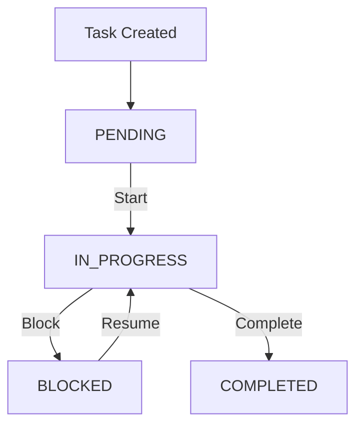

# Tasks

A **Task** represents a unit of real work within a project.

Tasks give CTX a way to describe what is being worked on and track its current execution state. They are intentionally lightweight and are designed to work alongside sessions, logs, and decisions.

## Why Tasks Exist

A project can contain many pieces of work at different stages. Tasks provide that structure.

Each task represents a unit of work that can be created, worked on, blocked, and completed. Tasks are not intended to become a full project-management system. They provide just enough structure to keep track of the work being executed.

For example:

```text
T1: Build Project Management System (PENDING)
+-- T2: Design System Architecture (PENDING)
|   +-- T5: Design Database Schema (COMPLETED)
|   +-- T6: Design API Structure (COMPLETED)
|   +-- T7: Define Authentication Strategy (PENDING)
+-- T3: Implement Core Features (PENDING)
|   +-- T8: Implement User Management (IN PROGRESS)
|   +-- T9: Implement Task Management (COMPLETED)
|   +-- T10: Implement Notifications (PENDING)
+-- T4: Testing and Deployment (PENDING)
    +-- T11: Write Unit Tests (BLOCKED)
    +-- T12: Run Integration Tests (PENDING)
    +-- T13: Configure Production Deployment (PENDING)
```

## Task Lifecycle

A task follows a simple execution lifecycle. It starts as `PENDING`, moves to `IN_PROGRESS` when work begins, and becomes `COMPLETED` when the work is finished.

A task can also become `BLOCKED` when progress cannot continue. A blocked task can return to `IN_PROGRESS` once the blocking condition is resolved.



### Creating a Task

A newly created task represents work that exists but has not started yet. When a task is created, CTX:

- Creates a new task record.
- Assigns a unique identifier.
- Records the task creation time.
- Sets its initial status to `PENDING`.

### Starting a Task

A task in this state represents work that is currently being performed. When a task is started, CTX:

- Marks the task as `IN_PROGRESS`.
- Makes the task the project's task in progress.

### Blocking a Task

When work on a task cannot continue because something is preventing progress, the task can be marked as `BLOCKED`.

CTX records the reason for the blockage in `blockReason`.

A blocked task remains part of the project's active work. Once the blocking condition is resolved, the task can be started again and return to `IN_PROGRESS`.

### Completing a Task

When the work represented by a task is finished, CTX:

- Marks the task as `COMPLETED`.
- Records the completion time in `completedAt`.

A completed task remains available as part of the project's execution history.

## Nested Tasks

CTX supports hierarchical tasks, allowing a larger unit of work to be divided into smaller pieces while preserving the relationship between them.

For example, **Implement authentication** can contain **OAuth integration** and **Session handling**. **OAuth integration** can then be further divided into **Configure provider** and **Implement callback**, while **Session handling** can contain **Create session** and **Refresh session**. This allows related work to be organized according to its natural structure.

A task can be placed under another task when it is created, and an existing task can later be moved to a different parent or back to the root. CTX also limits the depth of the hierarchy so that task structures remain manageable.

:::important
**The parent represents the larger unit of work, while subtasks represent the smaller pieces of that work.**
:::

## Task Hierarchies

CTX provides both flat and hierarchical views of tasks, allowing the same set of tasks to be viewed according to the level of structure needed.

### Flat View

The flat view presents all tasks as a collection without emphasizing their parent-child relationships. This is useful when the hierarchy is not important and the focus is on finding or inspecting individual tasks.

For example, a project containing **Implement authentication**, **OAuth integration**, **Configure provider**, and **Implement callback** can be viewed simply as a list of those tasks, regardless of how they are related.

### Tree View

The tree view preserves the relationships between tasks and displays them according to their hierarchy. This makes the structure of larger pieces of work visible at a glance.

For example, **Implement authentication** can appear as the parent of **OAuth integration** and **Session handling**, with their respective subtasks displayed beneath them.

This makes it easier to understand how smaller pieces of work contribute to a larger task.

### Moving Tasks

CTX allows tasks to be reorganized within the hierarchy. A task can be moved from one parent to another, or moved to the root so that it is no longer a subtask of another task. This allows the hierarchy to evolve as the structure of the work changes.

## Tasks and Sessions

Visit [Sessions](../sessions/index.md#sessions-and-tasks) to understand tasks and sessions.

## Tasks and Logs

Tasks provide structure for the work, while logs capture what happens while that work is being performed.

When a task is in progress theres an option to associate a log with a task.

A task does not need to be continuously edited to reflect every step of development. Instead, its execution history can emerge through its logs.

This keeps the task lightweight while preserving the details of the work.

:::note
**Tasks describe the work. Logs describe its evolution.**
:::

## Tasks and Decisions

Important decisions can be associated with a task.

This keeps important reasoning close to the work it affects.

A task can therefore provide context not only about what is being done, but also about the observations and decisions surrounding that work.

## Task History

A task represents a piece of work from the moment it is created until it is completed.

During that period, the task may change state, become blocked, resume, or have its description or structure updated. The task itself preserves its current state, while logs and decisions provide the context around how that state evolved. This gives a task a history without requiring every change to become part of the task record itself.

Its associated logs and decisions provide the context needed to understand how it reached that state. Together, these records allow you to reconstruct the important parts of the task's execution.

Task history is useful when returning to work after some time has passed. You can use the surrounding records to understand:

- What was attempted.
- What problems were encountered.
- What changed during implementation.
- Which decisions were made.
- Which sessions contained the work.
- How the task eventually reached its current state.

The result is a more complete picture of the work than the task record alone can provide.

:::note
CTX deliberately keeps the current task state separate from its execution context. This separation keeps the task itself lightweight while allowing the project's execution history to retain the context that would otherwise be lost.
:::

## Summary

Tasks provide CTX with a lightweight representation of work being executed.

A task:

- Represents a unit of real work.
- Belongs to a project.
- Has a current execution state.
- Can be `PENDING`, `IN_PROGRESS`, `BLOCKED`, or `COMPLETED`.
- Can contain nested subtasks.
- Can continue across multiple sessions.
- Can be associated with logs and decisions.
- Preserves its current state separately from its execution history.
- Provides a clear representation of what is being worked on.
