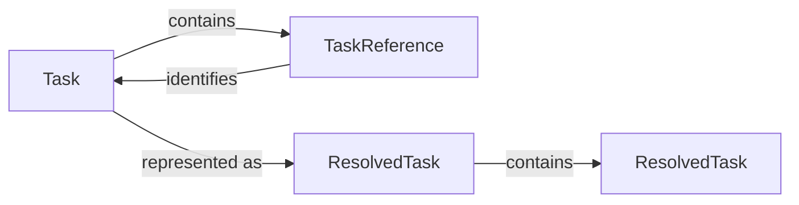

# Task

CTX uses three related representations when working with tasks:

- `Task` - represents the complete task record.
- `TaskReference` - represents a relationship to another task by its identifier.
- `ResolvedTask` - represents a task after its references have been resolved for use.  

These representations serve different purposes. A task contains its own information, while references keep task relationships lightweight. A resolved task is used when CTX needs the referenced task information rather than only its identifier.

## Task

`Task` is the primary task model persisted by CTX. It contains the information that describes the work, its current state, its lifecycle timestamps, and its relationships with subtasks.

### Fields

| Field | Type | Required | Description |
| --- | --- | --- | --- |
| id | [Identifier](../../identifier/) | Yes | Unique identifier for the task. |
| task | String | Yes | Short name identifying the work. |
| description | String | No | Additional context describing the work. |
| status | Enum | Yes | Current execution state of the task. |
| subtasks | List\<[TaskReference](#task-reference)> | Yes | References to child tasks. |
| createdAt | Date | Yes | Timestamp at which the task was created. |
| completedAt | Date | No | Timestamp at which the task was completed. |
| blockReason | String | No | Reason the task is blocked. |

:::note
The complete task is stored as a task record. Subtasks are not stored as complete task objects inside the parent task. Instead, the parent stores references to them.
:::

### Field Details

#### id

- The task identifier uniquely identifies a task within the project context.
- The identifier is generated when the task is created and does not change during the task's lifetime.

#### task

- The task field identifies the work represented by the task.
- It is required and should provide a concise description of the work.
- A task field is limited to **150 characters**.

#### description

- The description provides additional context when the task alone is not sufficient.
- Descriptions can contain multiple lines and are intended for information that helps someone understand the task itself.
- They are optional and limited to **300 characters**.

#### status

- The status indicates the current execution state of the task.
- Supported values are:

    | Value | Meaning |
    | --- | --- |
    | PENDING | The task exists but work has not started. |
    | IN_PROGRESS | Work is currently being performed. |
    | BLOCKED | Work cannot continue because of a blocking condition. |
    | COMPLETED | The work represented by the task has been completed. |

#### subtasks

- `subtasks` represents the child tasks belonging to the task.
- The collection contains references to child tasks rather than complete copies of the child task records.

#### createdAt

- `createdAt` records when the task was created.
- The value is always present and remains unchanged after creation.

#### completedAt

- `completedAt` records when the task reaches `COMPLETED`.
- The field remains `null` while the task has not been completed.

#### blockReason

- `blockReason` explains why a task is currently blocked.
- The field is populated when the task is `BLOCKED` and remains `null` when the task is not blocked.

## Task Reference

A **TaskReference** is a lightweight reference to another task. It contains only the identifier of the referenced task.

### Fields

| Field | Type | Required | Description |
| --- | --- | --- | --- |
| id | [Identifier](../../identifier/) | Yes | Unique identifier for the referenced task. |

The references do not contain copies of the referenced tasks. This is how CTX represents task hierarchy without embedding complete task records inside other tasks. For example, a parent task may contain references to T2 and T3, while the actual task records remain separate. This distinction is important because a reference answers which task is related to this task. But not what is that task.

## Resolved Task

A **ResolvedTask** is the representation used when a task reference has been resolved to its corresponding task. Instead of working only with **Task** and **TaskReference**, CTX can resolve that reference to the corresponding task. This is particularly useful when CTX needs to display or operate on a task hierarchy.

### Fields

| Field       | Description                                                                            |
| ----------- | -------------------------------------------------------------------------------------- |
| id          | Unique identifier for the task.                                                        |
| task        | Short description identifying the work.                                                |
| description | Additional context about the work.                                                     |
| status      | Current execution state of the task: `PENDING`, `IN_PROGRESS`, `BLOCKED`, `COMPLETED`. |
| subtasks    | Resolved child tasks represented as a list of `ResolvedTask`.                          |
| createdAt   | Timestamp at which the task was created.                                               |
| completedAt | Timestamp at which the task was completed. Stays `null` while not completed.           |
| blockReason | Reason the task is currently blocked. Stays `null` while not blocked.                  |

The stored task relationships therefore remain lightweight, while the resolved representation provides the information required by the operation being performed.

## How the Models Work Together

The three representations form a simple relationship. A `Task` is the persisted task record and contains a list of `TaskReference` objects for its child tasks. Each `TaskReference` contains only the identifier of the referenced task.

When CTX needs the complete task information, it uses the reference identifier to retrieve the corresponding `Task` and converts it into a `ResolvedTask`. This resolution is recursive, so the `ResolvedTask` contains a list of child `ResolvedTask` objects rather than `TaskReference` objects.

For example, a stored task **T1** can contain references to tasks **T2** and **T3**. Task **T2** can contain a reference to task **T4**, while **T3** and **T4** can have no subtasks. The task records remain separate, and the parent task stores only references to its child tasks.

When the references are resolved, **T1** can be represented as a `ResolvedTask` containing the resolved **T2** and **T3** tasks. The resolved **T2** contains the resolved **T4** task, producing a complete hierarchy such as **T1 – Implement authentication**, with child **T2 – OAuth integration**, which contains **T4 – Implement callback**, and child **T3 – Session handling**.

This separation gives CTX two useful properties:

- Lightweight persistence - task relationships are stored as `TaskReference` objects containing only task identifiers.
- Recursive resolution - when complete hierarchy information is required, `TaskReference` objects are resolved into `Task` records and represented as nested `ResolvedTask` objects.

`ResolvedTask` therefore represents the resolved view of a `Task`, rather than another persisted representation of the task. `ResolvedTask.subtasks` contains resolved children, whereas `Task.subtasks` contains lightweight references.
