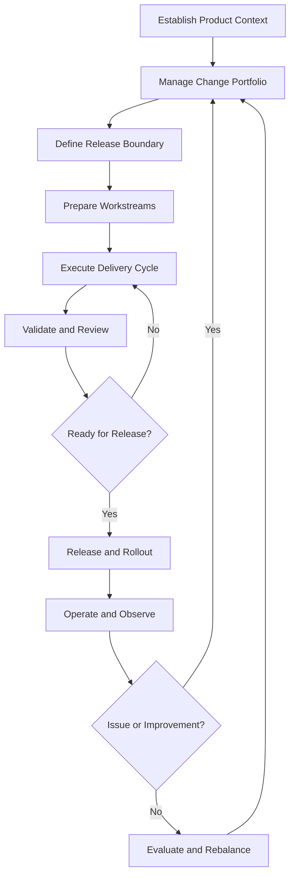

# Advanced Workflow

The advanced workflow is for teams that maintain an evolving product or production system over time. It supports recurring feature work, bug fixes, security improvements, technical debt, releases, incidents, and operational maintenance without losing the context behind each change.

Unlike the intermediate workflow, which focuses on completing a larger project through defined sections, the advanced workflow is continuous. A product may reach individual release milestones, but operation, feedback, and improvement continue to create new work.

## The Process



### 1. Establish Product Context

Begin by understanding the current state of the product or system.

Review:

- What the product is intended to achieve
- Who currently depends on it
- What is working
- What is incomplete, fragile, or changing
- Which technical constraints matter
- Which operational risks are known
- Which decisions and guidelines should remain consistent

The purpose is not to document the entire product. It is to recover enough shared context to make the next change safely.

Use CTX to inspect the current state:

```bash
ctx status
ctx task tree
ctx logs --count=20
```

If the project context does not exist, initialize it explicitly:

```bash
ctx init
```

At this stage, the important question is:

> What are we operating, what condition is it in, and what must we understand before changing it?

### 2. Manage the Change Portfolio

Collect and organize the changes competing for attention.

The portfolio may contain:

- New product capabilities
- Customer requests
- Bugs and regressions
- Security concerns
- Performance problems
- Operational improvements
- Technical debt
- Maintenance work
- Deferred decisions
- Follow-up work from incidents or releases

Not every item should become immediate work. Each change should be understood well enough to decide whether it should be started, deferred, combined, rejected, or investigated further.

Record important decisions and dependencies in CTX:

```bash
ctx decision create \
  --topic="Prioritize authentication hardening before reporting features" \
  --reasoning="The current authentication flow creates higher security and operational risk." \
  --tags=SECURITY
```

Record issues that affect future prioritization:

```bash
ctx log add \
  --tag=ISSUE \
  --note="Reporting work depends on the authentication changes."
```

CTX does not replace an issue tracker or product backlog. It preserves the reasoning behind the current priorities and the relationship between planned work and the wider product context.

### 3. Define the Release Boundary

Choose which changes belong together in the next delivery boundary.

A release boundary may be:

- A feature release
- A maintenance release
- A bug-fix release
- A security release
- A larger product milestone
- An infrastructure or operational change

The boundary should be small enough to understand, validate, and recover from. It should also make dependencies and risk visible before implementation begins.

Define:

- The intended outcome
- Included changes
- Explicit exclusions
- Dependencies
- Known risks
- Validation expectations
- Release conditions
- Rollback or recovery expectations

The release boundary is a decision, not merely a collection of tasks. Record why it exists and what would cause it to change.

### 4. Prepare Independent Workstreams

Break the release boundary into workstreams that can be executed and reviewed independently.

Possible workstreams include:

- Product functionality
- Backend or API changes
- Frontend changes
- Data or migration work
- Testing and quality
- Documentation
- Deployment configuration
- Monitoring and operational readiness

Each workstream should have a clear outcome. It should also be possible to understand its progress without reconstructing the entire release.

Create tasks with enough context for another session or developer to continue:

```bash
ctx task create \
  --task="Implement authentication token rotation" \
  --description="Add token rotation, update validation, and cover expiry and reuse cases."
```

Start the task when active work begins:

```bash
ctx task start <task-id>
```

If a task depends on an unresolved decision or external condition, record that dependency instead of leaving it implicit.

### 5. Execute the Delivery Cycle

Implement the selected work in small, reviewable increments.

During execution:

- Keep the active task current
- Integrate changes frequently
- Record meaningful discoveries
- Record failed approaches that affect future work
- Capture decisions that change the original direction
- Keep incomplete work distinguishable from completed work

Use a session to preserve working context across interruptions:

```bash
ctx start --notes="Implementing authentication token rotation for the next release."
```

Record meaningful attempts or discoveries:

```bash
ctx log add \
  --tag=ATTEMPT \
  --note="The first rotation approach failed because refresh tokens were not invalidated consistently." \
  --task
```

When a task is complete:

```bash
ctx task complete <task-id>
```

If work cannot continue:

```bash
ctx task block <task-id> \
  --reason="Waiting for the migration strategy to be approved."
```

CTX does not replace source control, code review, CI, or deployment systems. Its role is to preserve the execution context surrounding those systems: what was being attempted, why the approach changed, and what remains unfinished.

### 6. Validate and Review the Change

Validation should happen throughout the delivery cycle, not only at the end.

Review the change against:

- The intended outcome
- Existing product behavior
- Relevant technical decisions
- Security and data concerns
- Performance expectations
- Documentation requirements
- Operational impact
- Failure and recovery behavior

The result of validation should be evidence, not simply a statement that the work appears complete.

Record important findings:

```bash
ctx log add \
  --tag=NOTE \
  --note="Token rotation passed expiry, reuse, and concurrent-request tests."
```

If validation exposes a new problem, create or update follow-up work instead of silently expanding the current task:

```bash
ctx task create \
  --task="Handle concurrent refresh requests safely" \
  --description="Follow-up discovered during token rotation validation."
```

A change is ready to move forward when its required behavior is implemented, its risks are understood, and the evidence needed for release is available.

### 7. Decide Whether the Change Is Ready for Release

Review the release boundary as a whole.

Ask:

- Are all required changes complete?
- Are known blockers resolved?
- Are dependencies satisfied?
- Has the combined system been validated?
- Are migrations sufficiently protected?
- Is monitoring available
- Is rollback understood?
- Are release notes or operational instructions ready?
- Is the remaining risk acceptable?

If the answer is no, return to execution or create follow-up work.

If the answer is yes, record the release decision:

```bash
ctx decision create \
  --topic="Approve authentication release" \
  --reasoning="Required implementation, integration tests, migration checks, and rollback preparation are complete." \
  --tags=RELEASE
```

The release should not be considered complete merely because individual tasks are marked completed.

### 8. Release and Rollout

Move the validated change into the target environment using the project’s existing release process.

This may include:

- Building and packaging
- Deploying to staging
- Running final checks
- Approving production exposure
- Performing a gradual rollout
- Communicating the change
- Confirming the deployed version

The actual release process belongs to the project’s deployment and operations tooling. CTX preserves the context around the release:

- What was released
- Why it was released
- Which decisions shaped it
- What risks were accepted
- What should be watched after rollout

Record the release milestone:

```bash
ctx log add \
  --tag=NOTE \
  --note="Authentication token rotation released to production."
```

If the rollout fails, do not treat the failed release as an ordinary completed task. Preserve the evidence and move the affected work into incident or recovery handling.

### 9. Operate and Observe

After release, observe the product in its real operating environment.

Review:

- Errors and failures
- Performance
- Resource usage
- User-facing behavior
- Security signals
- Deployment health
- Support or customer feedback
- Unexpected interactions with existing functionality

Distinguish between:

- Normal behavior
- A known limitation
- A minor improvement
- A release regression
- An urgent incident
- A systemic problem

Record important operational findings:

```bash
ctx log add \
  --tag=ISSUE \
  --note="Authentication failures increased after rollout and require investigation."
```

The purpose of this stage is to connect what was delivered with what actually happened after delivery.

### 10. Handle Incidents and Recovery

When a production issue occurs, prioritize restoring a safe and usable system.

The immediate response may include:

- Confirming the incident
- Assessing impact
- Identifying the affected change
- Applying a mitigation or rollback
- Recording the current state
- Tracking recovery work
- Reviewing the cause after service is restored

Create a dedicated recovery task:

```bash
ctx task create \
  --task="Investigate authentication failures after release" \
  --description="Determine whether the release caused the increase in failed authentication requests."
```

Record meaningful attempts and decisions:

```bash
ctx log add \
  --tag=ATTEMPT \
  --note="Rollback reduced authentication failures; investigate the release before redeployment."
```

After the immediate problem is resolved, return the incident to the change portfolio. The follow-up may involve:

- A bug fix
- Additional tests
- Improved monitoring
- A design change
- A new operating guideline
- A change to the release process

### 11. Maintain Engineering Standards and Product Direction

Long-running products accumulate decisions, conventions, and operational knowledge.

Periodically review whether the current direction still supports the product.

This may involve:

- Updating technical guidelines
- Replacing an outdated approach
- Revisiting architectural decisions
- Removing obsolete assumptions
- Improving testing and release practices
- Documenting recurring operational procedures
- Identifying areas where technical debt is increasing risk

Record decisions when the direction changes:

```bash
ctx decision create \
  --topic="Adopt a shared authentication validation policy" \
  --reasoning="Repeated inconsistencies across services increased maintenance and security risk." \
  --tags=ARCHITECTURE,SECURITY
```

CTX should preserve the history and reasoning of these decisions so future work does not repeatedly revisit the same questions.

### 12. Evaluate and Rebalance

At the end of a delivery cycle, release, incident, or significant period of operation, evaluate the current state.

Review:

- What changed
- What was delivered
- What did not work
- Which assumptions were invalidated
- Which tasks remain active or blocked
- Which risks increased or decreased
- Which decisions should be revisited
- What should enter the next delivery boundary

Use CTX to recover the information needed for this review:

```bash
ctx status
ctx task query -x equals:BLOCKED
ctx log query -x equals:ISSUE
ctx decision query -x contains:authentication
```

The result is not necessarily project completion. It is a better understanding of what should happen next.

The workflow then returns to change management, where the next delivery boundary is selected using the latest product and operational context.

## What’s Better with CTX

Without persistent execution context, long-running product work becomes fragmented across:

- Issue trackers
- Pull requests
- Code comments
- Release notes
- Incident channels
- Personal notes
- Separate AI sessions
- Individual memory

These systems may contain useful information, but they do not always preserve the reasoning connecting one stage to another.

CTX provides a shared project-level record of:

- The current working context
- Active and completed tasks
- Blocked work and its reasons
- Meaningful discoveries
- Failed attempts
- Product and technical decisions
- Session continuity
- The relationship between delivery work and operational follow-up

This makes it easier to answer:

- Why was this change prioritized?
- What was attempted before?
- Which decision led to the current implementation?
- What remains blocked?
- What should the next developer or AI agent understand?
- What changed after the last release?
- Which issues should influence the next delivery cycle?

## Completion

The advanced workflow has no permanent completion point.

A single delivery cycle may complete when its changes are released and evaluated. An incident may complete when service is restored and follow-up work is recorded. A product may reach a stable milestone, but continued operation creates new requirements, risks, and improvement opportunities.

The workflow is complete for a cycle when:

- The intended change has been delivered or deliberately deferred
- The resulting system state is understood
- Important decisions and findings are recorded
- Remaining work is visible
- Follow-up priorities are clear
- The next cycle can begin without reconstructing the previous one
