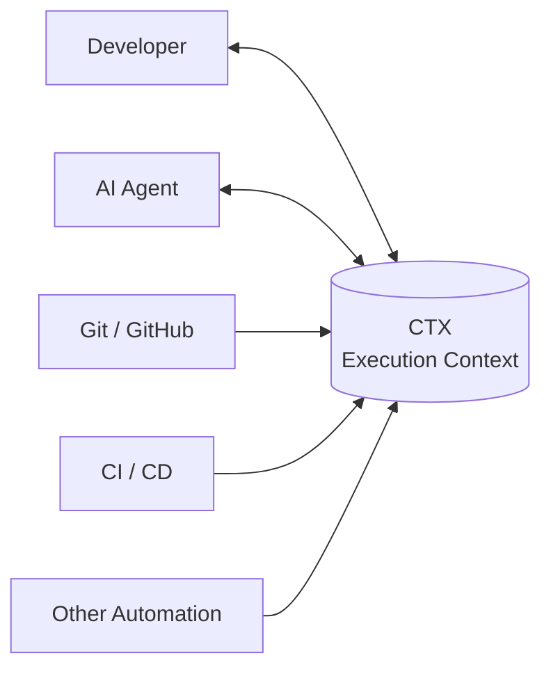
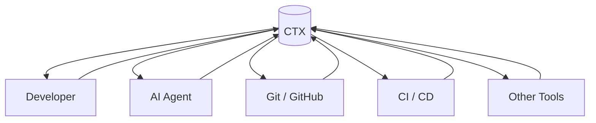
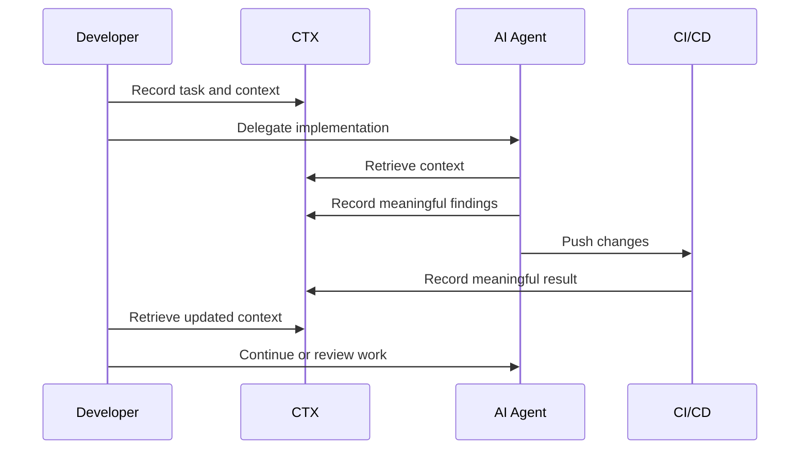

# Advanced

## Development Workflow with CTX

At the advanced level, CTX becomes part of the wider development system.

The context of development is no longer produced only by the developer. AI agents, Git workflows, CI/CD pipelines, hooks, and other automation can also participate when they perform meaningful work or observe information worth preserving.

CTX provides a shared execution-context layer across these participants.

The goal is not to send every event into CTX. The goal is to make useful execution context available wherever development work happens.



This workflow builds on the Beginner and Intermediate workflows. It assumes that CTX is already part of your normal development process and that you are comfortable maintaining tasks, sessions, logs, and decisions.

---

## Establish shared execution context

Start by treating CTX as a shared record of what is happening in the project.

The source code describes what the project contains. Git describes how the source changes. Other tools describe their own activity.

CTX captures the execution context around that work.

```text
Developer ──────┐
AI agent ───────┤
Git / GitHub ───┤
CI / CD ────────┼──> CTX
Automation ─────┤
Other tools ────┘
```

Each participant can use CTX to understand the current state of work before acting.

This is especially useful when work moves between people, machines, agents, or development environments.

---

## Read context before meaningful work

When a participant begins work, CTX can provide the context needed to continue.

A developer can inspect the current task, active session, recent logs, decisions, or query the information relevant to the work.

An AI agent can do the same before making changes.

Automation can retrieve context when its operation depends on the current state of development.

The important principle is:

> **Context should be retrieved when it is useful, not reconstructed from scratch.**

CTX does not need to be the first system consulted for every operation. It becomes valuable when the execution context affects what should happen next.

---

## Let participants contribute context

CTX is a shared execution record.

Humans, AI agents, and automation can contribute to it when they perform meaningful work or discover information that should remain available later.

For example:

- A developer records an important observation.
- An AI agent records a meaningful discovery during implementation.
- A developer or agent records a decision and its reasoning.
- Automation records a significant state change.
- CI records useful execution information that helps explain what happened.

The important distinction is between **meaningful context** and **raw activity**.

Not every command, tool call, Git operation, or CI step needs to become a CTX record.

### Read broadly, write deliberately

CTX works best when participants can retrieve the context they need while writing only information that has lasting value.

Avoid turning CTX into an event stream such as:

```text
every command      → CTX
every tool call    → CTX
every Git command  → CTX
every CI step      → CTX
```

Instead, preserve information that helps someone understand the work, continue it, or reason about what happened.

---

## Connect context with Git

Git remains responsible for source control.

CTX does not replace commits, branches, pull requests, or repository history.

Instead, Git activity can provide useful points where execution context and source history meet.

For example, a development workflow might associate meaningful context with:

- a task being started or completed;
- a significant decision;
- an implementation milestone;
- a change that requires explanation;
- a branch or pull request;
- a release or deployment.

Git hooks or other repository automation can be used when they provide useful context without creating unnecessary records.

The goal is not to mirror Git history inside CTX.

The goal is to make the relationship between **what changed** and **why or how the work progressed** easier to understand.

---

## Connect context with CI/CD

CI/CD systems provide another part of the development lifecycle.

A pipeline may know that a build failed, a deployment succeeded, or a particular stage produced an important result.

CTX can preserve selected information from these processes when it is useful for understanding the execution history of the project.

For example:

```text
Developer
    │
    ├── Task: prepare release
    │
    └── Commit
          │
          ▼
       CI/CD
          │
          ├── Build
          ├── Test
          └── Deploy
                │
                ▼
              CTX
```

Only information with contextual value needs to be recorded.

Routine pipeline output can remain in the CI/CD system where it already belongs.

---

## Use hooks and automation selectively

Hooks and automation can extend CTX without requiring every participant to interact with it manually.

A useful automation usually answers one of these questions:

- What important event just happened?
- What context should be available to the next participant?
- What information would otherwise be lost?
- What should a developer or AI agent know when continuing this work?

For example, an automation could record that a deployment completed or that a particular development milestone was reached.

It should not blindly copy every underlying event into CTX.

Automation should preserve **context**, not activity volume.

---

## Treat AI agents as participants

AI agents can use CTX in the same way a developer does.

An agent can retrieve the current execution context before working and contribute meaningful context after performing work.

For example:

```text
CTX
 │
 ├── current task
 ├── recent logs
 ├── relevant decisions
 └── session context
        │
        ▼
    AI agent
        │
        ├── investigates
        ├── changes code
        └── records useful context
```

This allows an agent to participate in the same execution context as the developer instead of maintaining a separate understanding of the project.

The agent does not need a special CTX interface.

It can use the same CLI available to the developer.

---

## Support multiple participants

As more people and agents participate in a project, execution context becomes increasingly important.

Different participants may work on different tasks, sessions, or environments while contributing to the same project.

CTX provides a shared project-level context that can help connect that work.

This does not require every participant to follow exactly the same workflow.

One developer may use detailed task structures while another may work with a smaller set of tasks. An AI agent may retrieve context more frequently than a human.

The shared requirement is that meaningful context remains available to whoever needs to continue the work.

---

## Keep context close to the project

CTX remains local to the project.

The `.ctxcli` directory belongs to the project context rather than to a central CTX service.

This makes it possible to choose how different parts of the context participate in version control.

For example, a team may decide to:

- version project-wide decisions and useful development history;
- ignore session-specific information;
- share selected context between developers;
- keep machine-specific context local.

The exact strategy depends on the project and team.

CTX provides the context model; the development team decides how that context should move through its repository and infrastructure.

---

## Extend CTX through the development system

Once CTX is part of the development system, other tools can build on the same context.

Possible extensions include:

- Git hooks
- GitHub workflows
- CI/CD pipelines
- release automation
- AI coding agents
- development scripts
- team tooling
- project-specific automation

These integrations do not need to make CTX the central controller.

Instead, they allow different parts of the development system to participate in a shared execution context.



The architecture remains simple:

**CTX provides execution context. Other systems continue to do what they are designed to do.**

---

## Keep the context useful

As more systems participate, the amount of available information can grow quickly.

That makes discipline more important, not less.

Prefer information that helps answer questions such as:

- What are we working on?
- What has changed?
- Why was this decision made?
- What happened during the work?
- What is blocked?
- What should happen next?
- What does another participant need to know?

Avoid using CTX as:

- a replacement for Git;
- a replacement for an issue tracker;
- a complete CI/CD log;
- an application monitoring system;
- a raw event store;
- a transcript of AI activity.

CTX should remain focused on **execution context**.

---

## Continue work across the system

The value of an advanced workflow becomes most visible when work moves between participants.

A developer may begin a task, an AI agent may continue implementation, CI may validate the change, and another developer may review or continue the work.

The participants can use the same CTX records to understand the execution history.



The workflow does not depend on any single participant remembering everything.

The execution context remains available as the work moves through the development system.

---

## Keep CTX in its role

Advanced usage does not mean making CTX responsible for everything around development.

Git should remain the source control system.

Issue trackers and project-management systems can remain responsible for planning and organizational workflows.

CI/CD systems should continue to run and report builds, tests, and deployments.

AI agents should remain responsible for the work they perform.

CTX connects these activities through the execution context that surrounds them.

That boundary keeps CTX lightweight while still allowing it to participate in a much larger development system.

---

## What this workflow gives you

With this workflow, CTX becomes more than a tool you use manually during development.

It becomes a shared execution-context layer that different participants can read from and contribute to.

You can:

- continue work across sessions, people, and AI agents;
- preserve meaningful context alongside source changes;
- connect development activity with useful execution history;
- allow automation to contribute context where appropriate;
- give AI agents access to the same project context as developers;
- build project-specific integrations without turning CTX into the integration itself.

The result is a development system where context can move with the work instead of remaining trapped in individual sessions, tools, or people's memory.
