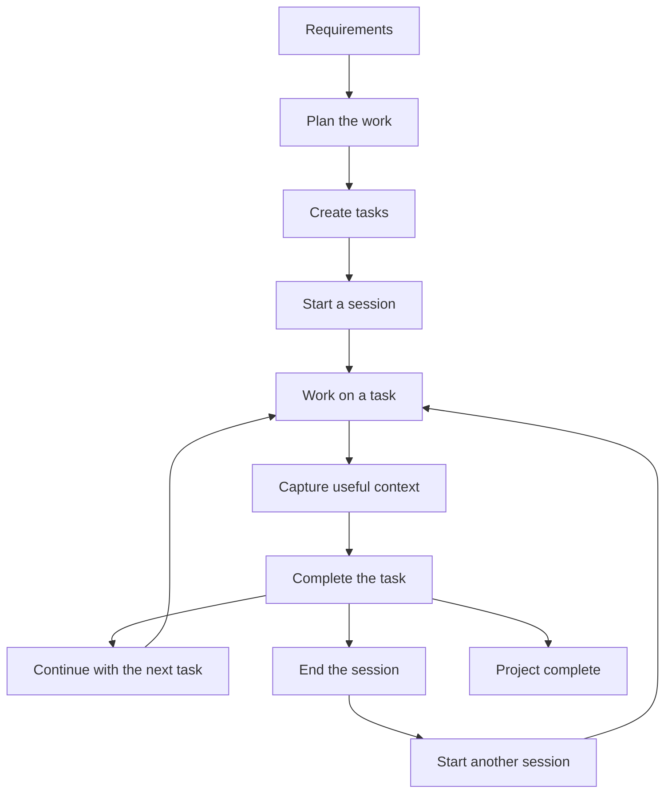
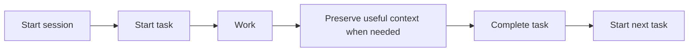
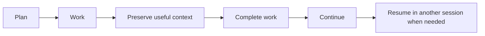

# Beginner

## Development Workflow with CTX

A straightforward development workflow for starting a new project from requirements and using CTX to preserve the context created while the work progresses.

The workflow follows a normal development process. CTX provides a structured place to keep track of the work, the sessions in which it happens, and the useful context created along the way.

The same workflows can be followed by both human and AI.



### 1. Break the requirements into tasks

Begin with the requirements of the project. Understand what the project needs to accomplish before deciding how the work will be implemented. At this stage, the requirements describe the desired outcome. The next step is to turn that understanding into concrete work.

Decompose the requirements into tasks that represent meaningful pieces of work. Keep the initial task list simple. Each task should represent a meaningful piece of work that can be started and completed independently.For example:

1. Build user authentication
2. Add user registration
3. Add login
4. Add logout
5. Add password reset

The important part is that each task represents something that can actually be worked on and completed. Creating the tasks in CTX is part of the planning process.

```bash
ctx task create -t="Build user authentication"
ctx task create -t="Add user registration"
ctx task create -t="Add login"
ctx task create -t="Add logout"
ctx task create -t="Add password reset"
```

The task list now provides a working representation of the planned development work.

:::important
Creating a task, starting a session doesn't need ctx to be initialized. But viewing them requires ctx to be initialized. Make sure to initialize ctx before viewing anything.

```bash
ctx init
```

:::

### 2. Start a session

When beginning a period of work, start a session. A session represents a period of active work. It provides a boundary around the work being performed at a particular time. A task can span multiple sessions, and a session can contain work on multiple tasks. This makes it possible to distinguish the work itself from the period in which that work happened.

```bash
ctx session start
```

### 3. Start working on a task

Choose a task and start working on it:

```bash
ctx task start <task-id>
```

At this point, CTX knows which task is currently being worked on within the active session.

The current state can be checked when needed:

```bash
ctx status
```

There is no need to repeatedly inspect CTX while working. The purpose is to establish the context and then get back to the actual development work.

### 4. Work normally

Continue development as you normally would.

Write code, run tests, inspect the application, review changes, make commits, and use the tools appropriate for the project.

Git can be used normally alongside CTX. The beginner workflow does not require any special relationship between CTX and version control.

### 5. Preserve useful context

Not everything that happens during development needs to be recorded. When something is worth preserving, capture it in CTX. There are two common forms of useful context in the beginner workflow.

#### Logs

Use a log for useful observations, ideas, issues, or attempts. For example:

```bash
ctx log -k=ISSUE -n="Login fails when the refresh token is expired"
```

Or:

```bash
ctx log -k=IDEA -n="Move authentication validation into the domain layer"
```

A log should preserve something that may be useful later. It should not become a record of every action performed during development.

#### Decisions

Use a decision when an important choice is made and its reasoning is worth preserving.

For example:

```bash
ctx decision create \
  -t="Use session-based authentication" \
  -r="The application is server-rendered and does not require a separate token-based API."
```

A decision preserves both the choice and the reason behind it.

This is different from a log. A log records something useful that happened; a decision records an important direction chosen for the project.

### 6. Complete the task

Continue working until the task is complete. When the work is finished:

```bash
ctx task complete <task-id>
```

The task is now part of the completed work rather than the remaining work. Start the next task when ready:

```bash
ctx task start <next-task-id>
```

The basic working rhythm is therefore:



This cycle continues throughout the session.

### 7. End the session

When the working period is over, end the session:

```bash
ctx session end
```

A task does not need to be completed before ending a session.

For example, a session might end while `Add login` is still being worked on. The task remains unfinished and can be continued during another session.

This is important because development work rarely fits neatly into one uninterrupted period.

### 8. Resume the work later

When returning to the project, start another session:

```bash
ctx session start
```

Then inspect the current context:

```bash
ctx status
```

Continue the unfinished task:

```bash
ctx task start <task-id>
```

The previous session records the earlier period of work. The task identifies what remains to be done, while logs and decisions preserve useful context from the work that has already happened.

The new session can therefore continue the existing work rather than treating it as a completely new starting point.

### 10. Repeat until the project is complete

Continue the same cycle as the project progresses:



There is no requirement to use every CTX capability for every task. Some tasks may only require a task record. Others may produce an issue worth logging or a decision worth preserving.

The workflow stays lightweight because context is captured when it has value.

## What this workflow gives you

By the end of a project, CTX has accumulated a structured record of the work that happened during development. You can understand:

- what work was planned through tasks.
- what work is currently being performed.
- which periods of work took place through sessions.
- what useful events or observations were worth preserving.
- which important decisions were made and why.
- where unfinished work can be resumed.

This gives the project an execution history alongside its source code and version-control history. The result is a record of planned work, active work, completed work, work periods, useful observations, and important decisions. When work resumes later, that record provides the starting point for continuing the project.

For a more robust workflow that uses the broader capabilities of CTX, continue with the [Intermediate Development Workflow](../intermediate/).
