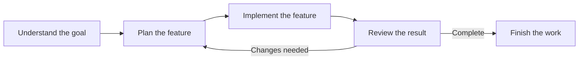

# Beginner Development Workflow with CTX

This workflow is for a small, clearly defined feature or change. It shows how a typical developer can use CTX to understand the goal, organise the work, implement it across one or more sessions, and review the result until it is complete.

## The Process



### Understand the Goal

Begin by clarifying what needs to change and why.

Understand the problem, the expected result, and the boundaries of the feature. Review the existing project context for related tasks, previous decisions, or useful information before making a plan.

If the context has not been initialised yet, create it first:

```bash
ctx init
```

Break the feature into smaller tasks and add them to CTX. If the project already has practices, guidelines, or constraints that should influence the implementation, record them as decisions so the reasoning is available while you work.

For example:

```bash
ctx task create --task "Add file locking"
ctx task create --task "Handle lock acquisition failure"
ctx task create --task "Add tests for concurrent access"
```

You can record an important practice or constraint as a decision:

```bash
ctx dec create
```

The goal is not to document every thought. Preserve the decisions that explain how the feature should be approached.

### Plan the Feature

Organize the tasks into a practical order.

Identify which task should be completed first, whether any task depends on another, and how you will verify the result. Keep the plan simple enough to follow, but detailed enough to make the next action clear.

Use CTX to review the tasks and make the current plan visible:

```bash
ctx task list
```

If the feature needs a particular structure or approach, record that reasoning in a decision. If the plan changes later, update the relevant task or decision rather than leaving the original plan as the only source of truth.

At the end of this stage, you should know what the first task is and what a successful implementation should look like.

### Implement the Feature

Start a session and choose the next task.

```bash
ctx start --notes "Implement file locking"
```

Start with the first task and work through it using the project’s existing tools, structure, and practices.

While implementing, use CTX to preserve useful information:

- Update tasks as their progress changes.
- Record important discoveries or failed attempts as logs.
- Review existing decisions when choosing between approaches.
- Record blockers when progress cannot continue.

For example, if you attempt to use an operating-system file lock and discover that the first approach does not work reliably, preserve that information:

```bash
ctx log add --note "Attempted OS-level file locking; behavior differs across platforms."
```

A log should capture information that may help you or someone else continue the work. It does not need to describe every command or action.

A feature may take several sessions. When stopping, leave the current task, progress, and next action clear before ending the session:

```bash
ctx session end
```

When you return, review the available context and continue from the task that is still in progress.

### Review the Result

Review the implementation against the original goal.

Check whether the feature behaves as expected, whether the relevant tests or checks pass, and whether the implementation fits the project’s existing structure. Review the result as a whole rather than checking only whether the individual tasks were completed.

Use CTX to see what has been completed and what remains:

```bash
ctx task list
```

```bash
ctx logs --count=5
```

Based on the review, move to the next task or revise the plan.

If the implementation exposes a new requirement, update the relevant task. If a previous decision no longer makes sense, update it with the new reasoning. If a discovery is useful for future work, preserve it in a log.

For example:

```bash
ctx task update <task-id> --note "Include platform-specific lock handling"
ctx decision update <decision-id> --reasoning "Use a platform-independent fallback when OS locking is unavailable."
```

Continue moving between planning, implementation, and review until the feature meets its intended goal.

## What's Better with CTX

Without CTX, the plan, unfinished work, decisions, and discoveries are often spread across memory, editor tabs, temporary notes, and commit messages.

CTX keeps those parts of the work connected inside the project:

- The goal remains visible. Tasks describe what needs to be achieved.
- The plan remains organised. Related tasks make the feature easier to break down and follow.
- The reasoning is preserved. Decisions explain why an approach was chosen.
- The work can be resumed. Sessions show when work started and ended, while tasks and logs preserve the current state.
- Important discoveries are not lost. Logs capture useful attempts, problems, and findings.
- Review can improve the plan. When implementation changes the understanding of the problem, CTX gives you a place to update the plan and reasoning.

The benefit is not that CTX adds more steps to development. It makes the steps you already take easier to remember, continue, and understand.

## Completion

The workflow is complete when the feature meets its intended goal, the implementation has been reviewed, and the relevant tasks are finished.

Before finishing, preserve the important outcome in CTX. Completed tasks should reflect the actual result, while decisions and logs should retain the reasoning, discoveries, or limitations that may matter later.

If the feature is not finished, leave it clearly paused instead of marking it complete. The remaining work and next useful action should be obvious when you return.
