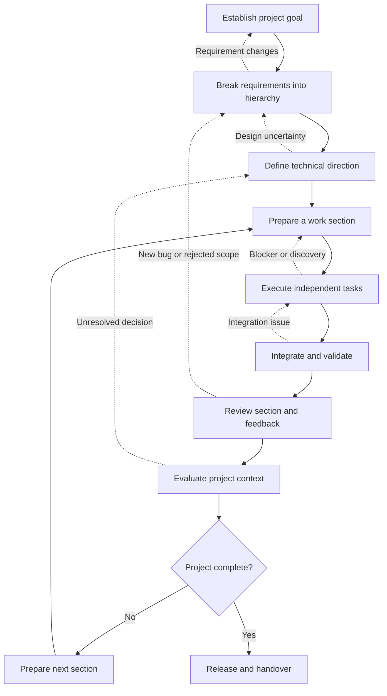

# Intermediate Development Workflow

This workflow helps a small development team deliver a larger project that contains multiple requirements, connected parts, and changing priorities. It is useful when the work must be divided into several sections, completed across multiple sessions, and repeatedly reviewed as new information becomes available.

Unlike a small, straightforward project, the entire implementation is not planned and completed in one continuous sequence. The team works through manageable sections, keeps dependent tasks waiting, executes independent tasks separately, and evaluates the project before deciding what to do next.

## The Process



### Establish the Project Goal

Start by understanding the broader outcome the team is trying to achieve.

Identify:

- The problem being solved
- The intended users
- The expected outcome
- The major capabilities
- The known constraints
- The initial project boundaries
- The questions that still need investigation

Do not attempt to create every implementation task immediately. At this stage, the goal is to establish a shared direction and identify the areas that need further refinement.

If the project already uses CTX, begin by retrieving its current state:

```bash
ctx status
```

Use focused commands only when the overview leaves an important question unanswered:

```bash
ctx task tree
ctx logs --count=20
ctx decision query -x contains:project
```

If the project does not yet have CTX context, initialize it explicitly:

```bash
ctx init
```

Record important initial assumptions or project constraints as short logs. For example:

```bash
ctx log add --tag=NOTE --note="The first delivery must support existing users without changing the current API contract."
```

The result of this stage should be a clear project goal and an initial understanding of the major areas of work.

### Break Requirements into a Hierarchy

Convert the broad project goal into requirements, capabilities, and executable tasks.

A larger project should not become one flat task list. Use a hierarchy that reflects how the work is related:

```txt
Project
├── Capability A
│   ├── Requirement A1
│   │   ├── Design
│   │   ├── Implementation
│   │   └── Validation
│   └── Requirement A2
├── Capability B
│   ├── Requirement B1
│   └── Requirement B2
└── Shared Foundation
    ├── Infrastructure
    ├── Common rules
    └── Integration support
```

For each requirement, clarify:

- Expected behavior
- Acceptance conditions
- Scope boundaries
- Dependencies
- Priority
- Whether the work can be delivered independently
- Whether the requirement is ready for implementation

Create parent tasks for meaningful requirements and child tasks for their deliverables:

```bash
ctx task create --task="Implement account management"
ctx task create --task="Add account persistence" --parent=<parent-task-id>
ctx task create --task="Add account API" --parent=<parent-task-id>
ctx task create --task="Add account validation" --parent=<parent-task-id>
```

Do not force every future detail into the hierarchy. Requirements that are not yet understood can remain broad until their delivery section approaches.

A requirement may later be split, refined, deferred, rejected, or replaced. Preserve those changes rather than silently rewriting the original task.

The result should be a structured project backlog that shows how the major requirements relate to one another.

### Define the Technical Direction

Before implementation begins, determine how the next set of requirements should fit into the existing system.

Review:

- Existing architecture
- Affected modules
- Data and API contracts
- Integration points
- Compatibility concerns
- Technical risks
- Reusable patterns
- Alternatives and trade-offs

Not every requirement needs a separate design phase. Simple work can follow an existing pattern. Work that affects architecture, shared contracts, data, or multiple components needs a clearer technical direction.

Record decisions when they establish a direction or resolve a material trade-off:

```bash
ctx decision create \
  --topic="Keep validation in the service layer" \
  --reasoning="This preserves the existing architecture and keeps validation consistent across API consumers."
```

Use [decision management](https://../guides/decisions.md)  for decisions that affect future work.

A decision should explain:

- The problem
- The selected approach
- The reason
- Important consequences
- The scope in which it applies

Repeated discussions about naming, testing, error handling, task structure, or implementation standards should eventually become decisions or project guidelines.

The result of this stage should be a viable technical direction for the next part of the project, with important decisions and risks recorded.

### Prepare a Work Section

Long projects should be divided into manageable sections.

A section is a meaningful group of requirements that can be implemented, integrated, and reviewed without waiting for the entire project to finish.

For example:

```txt
Section 1: Foundation
Section 2: Core capability
Section 3: Supporting capability
Section 4: Integration
Section 5: Release preparation
```

Before starting a section, define:

- Its objective
- The requirements it covers
- The tasks included
- The dependencies that must be satisfied
- The expected completion conditions
- The next section it enables

Review the current task hierarchy and identify tasks that are ready to begin:

```bash
ctx task tree
ctx task query -x equals:PENDING
```

Create additional tasks when the section reveals missing work:

```bash
ctx task create --task="Prepare integration test environment"
ctx task create --task="Document the new configuration"
```

A task that depends on unfinished work should remain waiting. Do not start it merely to make the task list appear active.

The result should be a bounded work section with clear tasks, dependencies, and completion conditions.

### Execute Independent Tasks

Start work on the tasks that are ready and can proceed independently.

For example:

```
Persistence changes ───────┐
                           ├── Integration
API changes ───────────────┤
                           │
UI changes ────────────────┘

Documentation ───────────────────
Tests ────────────────────────────
```

Each developer or AI agent should work within a clear task boundary.

Begin a substantive session by retrieving the current context:

```bash
ctx status
```

Start a session for the work:

```bash
ctx start --notes="Implementing persistence changes for the account capability."
```

Start the selected task:

```bash
ctx task start <task-id>
```

During the work, record only meaningful discoveries, issues, attempts, and milestones:

```bash
ctx log add \
  --tag=ISSUE \
  --note="The existing repository requires a migration before the new field can be persisted." \
  --task=<task-id>
```

If the discovery affects another task, create or update the relevant task rather than keeping the information only in the current session.

When the task is finished:

```bash
ctx task complete <task-id>
```

End the session when the work is complete or paused:

```bash
ctx session end
```

A task may continue across multiple sessions. A session may also contain work on more than one task. CTX preserves these as separate dimensions so the team can recover both what was worked on and when the work happened.

The result should be completed work packages and enough context for another contributor to continue without repeating the investigation.

### Manage Waiting and Blocked Work

Some tasks cannot proceed immediately.

A task may need to wait because:

- Another task has not finished
- A design decision is unresolved
- An external dependency is unavailable
- The requirement is unclear
- The test environment is not ready
- Another workstream has changed a shared contract

Mark the task as blocked when the reason prevents progress:

```bash
ctx task block <task-id> \
  --reason="Waiting for the updated API contract."
```

Record the relevant issue:

```bash
ctx log add \
  --tag=ISSUE \
  --note="The API contract is required before the client integration can continue." \
  --task=<task-id>
```

Use task queries to find work that can continue while the blocked task is waiting:

```bash
ctx task query -x equals:BLOCKED
ctx task query -x equals:PENDING
```

Do not treat all inactive tasks as blocked. Distinguish between:

- Pending: valid work that has not started
- Blocked: work prevented by a known issue or dependency
- Completed: work that satisfies its task conditions
- Deferred: valid work intentionally postponed
- Rejected: work that is no longer part of the project

If a task is no longer required, preserve the reason for rejecting or deferring it. Do not delete the task merely because it is no longer active.

The result should be a task state that explains why work is waiting and which other work can continue.

### Integrate and Validate the Section

When the independent tasks are ready, combine them and validate the section as a whole.

Check:

- Shared interfaces
- Data flow
- Component compatibility
- Error handling
- Configuration
- Migrations
- Unit behavior
- Integration behavior
- Regression behavior
- Acceptance conditions

Integration often exposes problems that were not visible when each task was developed independently.

For example:

- The API response does not match the client expectation
- Two tasks use different assumptions
- A shared model is insufficient
- A new change breaks existing behavior
- The selected design does not work across all requirements

Create a follow-up task when the issue needs separate work:

```bash
ctx task create --task="Resolve account API and UI contract mismatch"
```

Record the discovery:

```bash
ctx log add \
  --tag=ISSUE \
  --note="Integration exposed a mismatch between the API response and the UI model."
```

If the issue changes the technical direction, record a decision before continuing.

The result should be an integrated section with known defects and follow-up work clearly identified.

### Review the Section and Process Feedback

Review the completed section before starting the next one.

Evaluate:

- Whether the intended outcome was achieved
- Whether the acceptance conditions are still valid
- Whether the implementation matches the technical direction
- Whether the section introduced new risks
- Whether user feedback changed the requirement
- Whether the next section is still appropriate

Testing or user feedback may reveal a new bug. Classify it before creating more work:

- Bug in the current requirement
- Missing acceptance condition
- New requirement
- Usability problem
- Compatibility issue
- Documentation issue
- Technical debt
- Out-of-scope request

A feature may also be rejected after implementation begins. In that case, mark the work as rejected or deferred and preserve the reason:

```bash
ctx log add \
  --tag=NOTE \
  --note="The export option was rejected after review because it does not support the current user workflow."
```

Do not treat rejected work as unfinished implementation. It is a project decision.

The result should be a reviewed section with accepted work, rejected or deferred scope, discovered bugs, and clearly classified follow-up tasks.

### Evaluate the Project Context

After reviewing a section, evaluate the state of the whole project.

Use CTX queries to inspect:

- Active tasks
- Pending tasks
- Blocked tasks
- Completed tasks
- Recent issues
- Deferred work
- Rejected requirements
- Important decisions
- Repeated problems
- Work that has not progressed

For example:

```bash
ctx status
ctx task tree
ctx task query -x equals:BLOCKED
ctx log query -x equals:ISSUE
ctx decision query -x contains:validation
```

The purpose of querying is not only to retrieve records. It is to evaluate what the team should do next.

Possible outcomes include:

- Continue the current section
- Start the next section
- Reopen a task
- Split a task
- Resolve a blocker
- Record a decision
- Refine a requirement
- Reject obsolete work
- Pause the project
- Prepare the release

The project is complete only when its project-level completion conditions are satisfied. Completing one section does not mean the entire project is complete.

The result should be a current project assessment and a clear next action.

### Prepare the Next Section

If the project is not complete, return to delivery planning.

Review the remaining requirements and:

1. Recheck the task hierarchy.
2. Remove or classify obsolete work.
3. Revisit dependencies.
4. Add tasks created by bugs or feedback.
5. Confirm that required decisions are resolved.
6. Select the next meaningful section.
7. Identify the tasks that are ready to begin.
8. Start a new session from that section.

```bash
ctx status
ctx task tree
ctx start --notes="Starting the next project section."
```

Do not simply continue with the next task in a flat list. A new section should have its own objective, scope, dependencies, and completion conditions.

A team can pause a long project and later resume it without reconstructing its history.

### Release and Handover

Move to release and handover only after project evaluation confirms that the required project scope is complete.

Review:

- Project completion conditions
- Acceptance results
- Test results
- Documentation
- Configuration
- Migrations
- Compatibility
- Known limitations
- Remaining deferred work
- Handover information

Record the final state in CTX:

```bash
ctx log add \
  --tag=NOTE \
  --note="The project scope is complete. Remaining improvements are recorded as deferred follow-up work."
```

End the final session:

```bash
ctx session end
```

The final records should make it clear:

- What was delivered
- What was rejected
- What was deferred
- Which decisions were made
- What limitations remain
- Where future work should begin

## What’s Better with CTX

Long-running development work often becomes difficult to recover because its context is distributed across issue trackers, chat messages, terminal history, personal notes, and memory.

CTX keeps the execution context alongside the project:

- Sessions preserve when work happened.
- Tasks preserve what needs to be done.
- Parent and child tasks preserve how requirements are structured.
- Logs preserve meaningful discoveries, issues, and attempts.
- Decisions preserve why the team selected a direction.
- Queries help evaluate the current project state.
- Extracted context provides a readable project record without changing the original data.

This makes it easier for a small team to:

- Divide work between developers or AI agents
- Continue tasks across multiple sessions
- Find independent work while another task is blocked
- Recover the reason behind a technical decision
- Understand why a requirement was rejected or deferred
- Connect bugs to the work that introduced them
- Prepare the next project section
- Resume work after an interruption

## Completion

The intermediate workflow is complete when the project has reached its agreed completion conditions and the team has recorded the final state.

The team should have:

- Established the project goal
- Broken requirements into a hierarchy
- Defined the technical direction
- Prepared and completed multiple work sections
- Executed independent tasks
- Managed waiting and blocked work
- Integrated and validated completed sections
- Responded to bugs and changing requirements
- Recorded important decisions and project practices
- Evaluated the remaining project context
- Released or handed over the completed project
- Preserved deferred work and future follow-up items

A project does not need to implement every idea discovered during development. It needs to complete the agreed scope and clearly record what happens to everything else.
