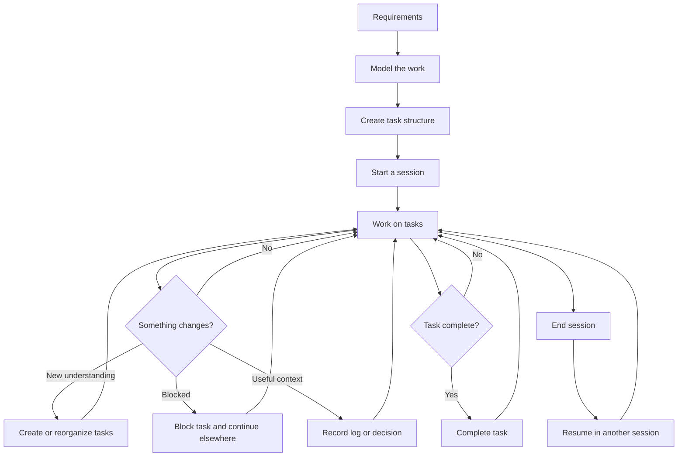
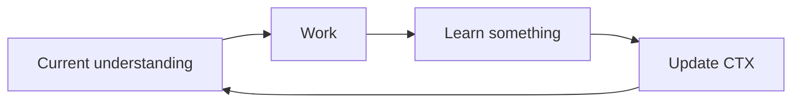

# Intermediate

## Development Workflow with CTX

A robust development workflow for projects where the work evolves as development progresses.

At this level, CTX is used not only to record work, but to maintain a useful representation of what the project currently requires, what is being worked on, what has changed, and what happened during development.

The task structure can evolve as understanding changes. Tasks can be reorganized, blocked, resumed, or completed. Sessions independently record the actual periods of work. Logs and decisions preserve useful context and can be linked to the task or session from which they originated.

The workflow remains flexible. CTX does not prescribe how a project must be structured or how Git branches must map to tasks. The developer chooses the structure that best represents the project.

The same workflow can be followed by both human and AI.



## 1. Model the work

Start with the project requirements and determine how the work should be represented.

Unlike the beginner workflow, the task structure does not have to remain flat. A larger piece of work can be represented using parent and child tasks when the hierarchy makes the work easier to understand and manage.

There is no single structure that fits every project.

For example, a feature might be organized by capability:

```text
Authentication
+-- Registration
+-- Login
+-- Password reset
```

Another project might be better represented by stages:

```text
Authentication
+-- Design
+-- Backend
+-- Frontend
+-- Testing
```

The important part is not the shape of the hierarchy. It is whether the structure provides a useful representation of the work.

Create the initial tasks in CTX:

```bash
ctx task create -t="Authentication"
ctx task create -t="Registration" <AUTHENTICATION-ID>
ctx task create -t="Login" <AUTHENTICATION-ID>
ctx task create -t="Password reset" <AUTHENTICATION-ID>
```

The task tree now represents the current understanding of the work.

The structure is not permanent. As development reveals more information, change it to reflect the new understanding.

## 2. Start a session

When beginning a period of work, start a session:

```bash
ctx session start
```

A session represents the actual period in which work takes place.

Sessions and tasks serve different purposes:

- A task represents work that needs to be done.
- A session represents a period of actual work.
- A task can span multiple sessions.
- A session can contain work on multiple tasks.

A session is therefore not a container for tasks. It is part of the project's work history. For example, a task might begin during one session, continue during another, and be completed during a third. The task describes the work. The sessions describe when the work actually happened.

## 3. Work through the task structure

Choose the task you want to work on and start it:

```bash
ctx task start <TASK-ID>
```

Work normally using the tools appropriate for the project. As development progresses, the task structure should reflect the current state of the work rather than an outdated plan.

For example, a task that initially looked simple may turn out to contain several distinct pieces of work. Create those tasks when the distinction becomes useful:

```bash
ctx task create -t="Token validation" <AUTHENTICATION-ID>
ctx task create -t="Session management" <AUTHENTICATION-ID>
```

Likewise, tasks can be moved when their relationship to the rest of the work becomes clearer:

```bash
ctx task move <TASK-ID> <NEW-PARENT-ID>
```

The goal is not to maintain a perfect plan from the beginning. The goal is to keep the task structure useful as the project evolves.

## 4. Manage changing work

Development rarely follows the original plan exactly. A task may become larger than expected, a new piece of work may be discovered, or an existing task may belong somewhere else in the hierarchy. Update the task structure when that happens.

### Add newly discovered work

If development reveals additional work, create a task for it instead of leaving it only in notes or memory:

```bash
ctx task create -t="Handle expired sessions" <PARENT-TASK-ID>
```

### Reorganize existing work

If an existing task belongs under a different part of the project, move it:

```bash
ctx task move <TASK-ID> <NEW-PARENT-ID>
```

### Update the task

When the task itself needs clarification, update its name or description:

```bash
ctx task update <TASK-ID> -t="Handle session expiration"
```

The task structure should represent the current understanding of the work. It is normal for that structure to change during development.

## 5. Handle blocked work

Sometimes a task cannot continue.

For example, Login may depend on a component that is not ready:

```bash
ctx task block <TASK-ID> -r="Waiting for the authentication service API"
```

Blocking makes the state explicit instead of leaving the task appearing to be ordinary unfinished work.

A blocked task does not need to stop the entire development process. Continue with other work that can make progress.

```text
Authentication
+-- Registration       COMPLETED
+-- Login              BLOCKED
+-- Password reset     IN_PROGRESS
+-- Session management PENDING
```

When the reason for the block is resolved, return to the task and continue working on it.

The purpose of blocking is not simply to mark a status. It allows the task structure to reflect what can and cannot currently move forward.

## 6. Preserve context where it originates

During development, useful information will appear. Not everything needs to be recorded. Preserve information when it is useful for understanding the work later. The important question is not only **what should be recorded**, but **where that context belongs**.

Link a log or decision to the thing that best describes it or from which it originated.

### Context from a task

If something happened specifically while working on a task, link it to that task:

```bash
ctx log -k=ISSUE -n="Expired tokens are rejected by the authentication library" -T=<TASK-ID>
```

The task is the source of the context, so the task is the appropriate reference.

### Context from a session

If something describes the work performed during a particular period rather than a specific task, link it to the session:

```bash
ctx log -k=NOTE -n="Spent the session investigating authentication libraries" -S=<SESSION-ID>
```

The session is the source of the context, so the session is the appropriate reference.

### Context without a specific origin

Some information does not belong specifically to a task or session. In that case, leave it unlinked. The reference should describe the origin of the context, not simply provide a place to attach it.

The same principle applies to decisions:

```bash
ctx decision create \
  -t="Use session-based authentication" \
  -r="The application is server-rendered and does not require a separate token-based API." \
  -T=<TASK-ID>
```

A decision about the implementation of a particular task can be linked to that task. A decision arising from the broader development session can instead be linked to the session.

## 7. Continue work across sessions

A task does not have to fit inside one session. When the working period ends, end the session:

```bash
ctx session end
```

The unfinished task remains unfinished. When returning later, start another session:

```bash
ctx session start
```

Then continue the relevant task:

```bash
ctx task start <TASK-ID>
```

The new session records a new period of work. The task continues to represent the same piece of work. This separation allows the project to retain both **the lifecycle of the work itself** and **the history of when the work was actually performed**. There is no requirement to summarize or reconcile the session before ending it. Context should be recorded when it occurs, and the session simply records the period of work.

## 8. Use Git with project context

CTX can be used alongside Git without requiring a fixed relationship between branches and tasks. The project context that describes the work can evolve with the source code and can be version-controlled.

For example:

```text
.ctxcli/
+--- config.json
+-- tasks.json
+-- logs.json
+-- decisions.json
+-- sessions.json
```

A project may choose to version-control the project context while keeping session history local

```gitignore title=".gitignore"
.ctxcli/sessions.json
```

This separates project context from personal work history.

Tasks, logs, and decisions can evolve with the project and move through Git history. Sessions describe local periods of work and do not need to follow branches or environments. How the remaining CTX files are versioned depends on how the project uses Git.

## 9. Establish a branch and context strategy

CTX does not require a particular relationship between branches and tasks.

A branch might represent a single feature, a larger work stream, a release, an experimental direction or  another unit of work meaningful to the project. The CTX structure should follow the way the project is being developed.

For example, if a branch represents a feature, that feature can become the root of a task hierarchy:

```text
Authentication
+-- Registration
+-- Login
+-- Password reset
```

Another project might keep several work areas in the same branch.

When different branches contain substantially different CTX state, merging those changes can require the same kind of reconciliation as other project files.

The important practice is to decide what the branch represents and version the project context accordingly. CTX does not impose a branch model on the project.

## 10. Be aware of session references across environments

Session history is intentionally different from project context. If `sessions.json` is not version-controlled, a session exists only in the environment where that work took place.

This matters when other version-controlled context references a session.

For example:

```text
logs.json
+-- Log L42
    +-- reference → Session S12
```

If `S12` exists only in another environment, that reference may not resolve there.

This does not make session references invalid. It means that session references should be used with an understanding of where the referenced session exists.

When context needs to remain meaningful across branches or environments, consider whether it is better associated with the task or left unlinked instead.

## 11. Keep the model current

Continue working through the project while allowing the CTX model to evolve with the work.



New work can be added. Existing tasks can be reorganized. Tasks can become blocked and later resume. Decisions can record important directions. Logs can preserve useful observations and events. Sessions continue recording the actual periods in which the work takes place. The task structure therefore remains a working representation of the project rather than a static plan created at the beginning.

## What this workflow gives you

By using CTX this way, the project maintains several complementary views of development:

- **Tasks** describe the work and its current state.
- **Task hierarchy** represents how the work is currently understood.
- **Sessions** record the actual periods in which work happened.
- **Logs** preserve useful events, observations, issues, ideas, and attempts.
- **Decisions** preserve important choices and their reasoning.
- **References** connect context to the task or session from which it originated.
- **Git** preserves the evolution of project context alongside the source code.

The result is not a fixed project plan. It is a working model that can change as the project changes.

You can now use CTX not only to remember what happened, but to continuously maintain the context of an evolving development process.

For workflows that extend CTX beyond the local development process and integrate it with other tools and infrastructure, continue with the [Advanced Development Workflow](../advanced/).
